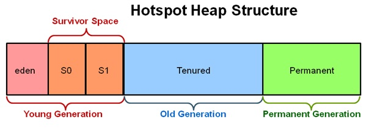

# Устройство Java

*Java Runtime Environment (сокр. JRE) - минимальная реализация виртуальной машины, необходимая для исполнения Java-приложений, без компилятора и других средств разработки. Состоит из виртуальной машины - Java Virtual Machine и библиотеки Java-классов.*

*Java Development Kit (сокращенно JDK) - комплект разработчика приложений на языке Java, включающий в себя компилятор Java (javac), стандартные библиотеки классов Java, примеры, документацию, различные утилиты и исполнительную систему Java (JRE).*

*Java Virtual Machine (сокращенно Java VM, JVM) - виртуальная машина Java - основная часть исполняющей системы Java, так называемой Java Runtime Environment (JRE). Виртуальная машина Java интерпретирует Байт-код Java, предварительно созданный из исходного текста Java-программы компилятором.*

## Загрузчики классов

- Базовый загрузчик
- Загручик расширений
- Системный загрузчик
  
Любой клас, используемый в Java программе был загружен в контекст программы каким-либо загрузчиком. Все JVM включают хотя бы один загрузчик классов, так называемый базовый загрузчик. Он загружает все основные классы.(!Уточнить, что за основные классы)
Этот загрузчик никак не связан с программой, то есть мы не можжем получить например у `java.lang.Object` имя загрузчика, а метод `getClassLoader()` вернет *null*

Следующий по иерархии загрузчик - загручик рашриений, он загружает классы из `$JAVA_HOME/lib/ext`
Следующий - Системный загрузчик, он загружает классы, путь к которым указан а переменной `$CLASSPATH`
Для примера предположим что у нас есть некий пользовательский класс MyClass и мы его используем. Как идет его загрузка:

- Сначала системный загрузчик пытается найти  его в памяти, если найден - класс успешно загружается, иначе управление загрузкой передается загрузчику расширений
- Загручик расширений также проверяет на наличие класса в памяти и в случае неудачи  передает задачу базовому загрузчику.
- Базовый загрузчик  снова пытается найти класс в памяти и в случае неудачи пытается его загрузить, если загрузка прошла успешно -  загрузка закончена. Если нет - передает управление загрузчику расширений
- Загрузчик  расширений пытается загрузить класс и в случае неудачи передает это дело системному загрузчику
- Системный  загрузчик пытается загрузить класс  и в случае неудачи вызывается исключение `java.lang.ClassNotFoundException`.

Если в системе присутствуют пользовательские загрузчики, то они должны быть унаследованны от класса `java.lang.ClassLoader`

### Что такое статическая и динамеческая загрузка классов

Статическая загрузка класса происходит при использовании  оператора `new`

Динамическая  загрузка происходит в  ходе выполнения программы с помощью  статического метода класса `Class.forName(className)`. Для чего нужна динамическая загрузка? Например мы не знаем какой класс нам понадобится и принимаем решение в ходе выполнения программы передавая имя класса в статический метод `forName()`.

## Какие механизмы обеспечивают безопасность в технологии Java

В технологии Java безопасность обеспечивают следующие три механизма:

- Структурные функциональные возможности языка (например, проверка границ массивов, запрет на преобразования непроверенных типов, отсутствие указателей и прочее).
- Средства контроля доступа, определяющие действия, которые разрешается или запрещается выполнять в коде (например, может ли код получать доступ к файлам, передавать данные по сети и прочее).
- Механизм цифровой подписи, предоставляющий авторам возможность применять стандартные алгоритмы для аутентификации своих программ, а пользователям - точно определять, кто создал код и изменился ли он с момента его подписания.

## Назовите несколько видов проверок которые выполняет верификатор байт кода Java

Ниже приведены некоторые виды проверок, выполняемых верификатором.

- Инициализация переменных перед их использованием.
- Согласование типов ссылок при вызове метода.
- Соблюдение правил доступа к закрытым данным и методам.
- Доступ к локальным переменным в стеке во время выполнения.
- Отсутствие переполнения стека.

При невыполнении какой-нибудь из этих проверок класс считается поврежденным и загружаться не будет.

## Что вы знаете о "диспетчере защиты" в Java

В качестве диспетчера защиты служит класс, определяющий, разрешено ли коду выполнять ту или иную операцию. Ниже перечислены операции, подпадающие под контроль диспетчера защиты. Существует немало других проверок, выполняемых диспетчером защиты в библиотеке Java.

- Создание нового загрузчика классов.
- Выход из виртуальной машины.
- Получение доступа к члену другого класса с помощью рефлексии.
- Получение доступа к файлу.
- Установление соединения через сокет.
- Запуск задания на печать.
- Получение доступа к системному буферу обмена.
- Получение доступа к очереди событий в AWT.
- Обращение к окну верхнего уровня.

## Потоки ввода-вывода в Java

Потоки ввода-вывода бывают двух типов:

- Байтовый поток(`InputStream` и `OutputStream`)
- Символьный поток(`Reader` и `Writer`)

Это все абстрактные классы екораторы. которым можно добавлять дополнительный функционал.
`InputStream in = new FileInputStream(new File("file.json"));`

## Для чего в Java статические блоки

Статичесике блоки в Java выполняются до выполнения конструктора, с их помощью инициализируются статические переменные.

```java
static final int i;
static {
    i=10;
}
```

Писать реализацию статического блока инициализации, в целом, необязательно, он создается сам при компиляции программы.
И при написании `public static int VAR = 404;`
Будет генерироваться следующий блок кода:

```java
public static int VAR;
static {
    VAR = 404;
}
```

## Можно ли перегрузить @Override static метод

~~Статические методы могут перегружаться нестатическими и наоборот - без ограничений. А вот в переопределении статического метода смысла нет.~~(!Уточнить, почему нет смысла?)

## Можно ли при переопределении метода @Override что либо изменить

- Модификатор доступа возможно изменить только в сторону расширения
- Возвращемый тип, если выполняется Downcasting (понижающее преобразования, до более узкого типа(Наследника))
- Тип аргументов или их количество, нет это называется перегрузкой (Overload)
- Имя аргументов, можно менять без органичений
- Изменить порядок, количество или убрать секцию `throws`, возможно изменить порядок, так же возможно убрать секцию `throws`, добавлять новые исключения, наследники определенных.

Переопределение методов действует при наследовании классов, т.е. в классе наследнике объявлен метод с такой же сигнатурой что и в классе родителе. Значит этот метод переопределил метод своего суперкласса.

Несколько нюансов по этому поводу:

- Модификатор доступа в методе класса наследника должен быть НЕ приватнее чем в классе родителе, иначе будет ошибка компиляции.
- Описание исключения в переопределенном методе класса наследника должен быть НЕ шире чем в классе родителе, иначе ошибка компиляции.
- Метод обьявленный как "private" в классе родителе нельзя переопределить!

## Устройство памяти в Java



### Что такое Heap и Stack память в Java

Java Heap - динамически распредляемая область памяти, создаваемая при старте JVM. Используется Java Runtime для выделения памяти под объекты и JRE классы. Создание нового объекта также происходит в куче. Здесь работает сборщик мусора, освобождает память путем удаления объектов на которые нет каких-либо ссылок. Любой объект, созданный в куче, имеет глобальный доступ и на него могут ссылаться с любой части приложения.

- Все объекты обитают в куче и попадают туда при создании
- Объект состоит из полей класса и методов
- В куче выделяется место под сам объект, количество выделенной памяти зависит от полей. если полем класса. скажем служет переменная типа `int`, то не важно инициализируешь ты ее как 0 или как 1000000 объект займет в куче свои биты + столько сколько вмещает тип int + 32 бита.

Стековая память в Java работает по схеме LIFO (Последний-зашел-Первый-вышел). Всякий раз, когда вызывается метод, в памяти стека создается новый блок, который содержит примитивы и ссылки на другие объекты в методе расположенные в RAM. Как только метод заканчивает работу, блок также перестает использоваться, тем самым предоставляя доступ для следующего метода. Размер стековой памяти намного меньше объема памяти в куче.(!Уточнить)

- Все методы находятся в стеке и попадают туда при вызове
- Переменные в методах так же имеют стековую память, поскольку они локальные
- Если в методе создается объект, то он помещается в кучу, но его ссылка все еще будет хранится в стеке и после того, как метод покинет стек, объект, который более не имеет ссылок будет уничтожен в куче.

### Какая разница межу Stack и Heap паматью в Java

- Куча используется всеми частями приложения в то время как стек используется только одним потоком исполнения программы
- Всякий раз, когда создается объект, он всегда хранится в куче, а в памяти стека содержится ссылка на него. Память стека содержит только локальные переменные примитивных типов и ссылки на объекты в куче
- Объекты в куче доступны с любой точки программы, в то время как стековая память не может быть доступна для других потоков
- Управление паматью в стеке осуществляется по схеме LIFO
- Стековая память существует лишь какое-то время работы программы, а память в куче живет с самого начала до конца работы программы
- Мы можем использовать `-Xms` и `-Xmx` опции JVM, чтобы определить начальный и максимальный размер памяти в куче. Для стека определить размер памяти можно с помощью опции `-Xss`
- Если память стека полностью занята, то Java Runtime вызывает `java.lang.StackOverflowError`, а если память кучи заполнена, то вызывается исключение `java.lang.OutOfMemoryError`
- Размер памяти стека намного меньше памяти в куче. Из-за простоты распределения памяти (LIFO), стековая память работает намного быстрее кучи.

### Main tesis

- Основные разделы куча (Heap) и стек
- В куче содержится статический контекст и непосредственно куча
- Куча состоит из двух частей Новая куча (Young generation Heap) и старой кучи (Tenured (Old Generation Heap))
- Новая куча тоде состоит из двух частей первая куча (Eden) и выжившая куча (Survivor Space)

*Eden Space (Heap) - В этой области выделятся память под все создаваемые из программы объекты. Большая часть объектов живет недолго (итераторы, временные объекты, используемые внутри методов и т.п.), и удаляются при выполнении сборок мусора этой области памяти. Когда данная область заполняется (т.е. количество выделенной памяти в этой области превышает некоторый заданный процент), GC выполняет быструю (minor collection) сборку мусора. По сравнению с полной сборкой мусора она занимает мало времени, и затрагивает только эту область памяти - очищает от устаревших объектов Eden Space и перемещает выжившие объекты в следующую область.*

*Survivor Space (Heap) – Сюда перемещаются объекты из предыдущей, после того, как они пережили хотя бы одну сборку мусора. Время от времени долгоживущие объекты из этой области перемещаются в Tenured Space.*

*Tenured (Old Generation Heap) - Здесь скапливаются долгоживущие объекты (крупные высокоуровневые объекты, синглтоны, менеджеры ресурсов и проч.). Когда заполняется эта область, выполняется полная сборка мусора (full, major collection), которая обрабатывает все созданные JVM объекты.*

*Permanent Generation (Non-Heap) - Здесь хранится метаинформация, используемая JVM (используемые классы, методы и т.п.).*

## Garbage Collector

- Много алгоритмов работы
- Очистка происходит если память в первой куче (Eden) полностью заполнена
- Удаляет объекты с пустой ссылкой (Более не использующиеся)
- Объекты на которые остались ссылки (Survived) переносит в выжившую кучу (Survivor Space) а первую кучу просто полностью очищает
- Если в первой куче осталось мало памяти для хранения, но при этом мало объектов не имеет ссылок, помечает и удаляет мусор, остальное перекомпоновывает.
- При нехватке места в выжевшей куче (Survivor Space) объекты все еще имеющие ссылки перемещает в старую кучу (Tenured (Old Generation Heap))
- Переодически вызывается сам, без события переполнения памяти

### Что произойдет со сборщиком мусора, если во время выполнения метода finalize() некоторого объекта произойдет исключение

Во время старта JVM запускается поток `finalizer`, который работает в фоне. Этот поток имеет метод `runFinalizer()`, который игнорирует все исключения методов `finalize` объектов перед сборкой мусора.

То есть если во время выполнения метода `finalize()` возникнет исключительная ситуация, его выполнение будет остановлено и это никак не скажется на работоспособности самого сборщика мусора

## Каким образом передаются переменные в методы, по значению или по ссылке

В Java параметры в методы передаются по значению, фактически создаются копии параметров и с ними ведется работа в методе.
В случае с примитивными типами, при передачи параметра сама переменная не будет меняться так как в метод просто копируется ее значение.
А вот при передачи объекта копируется ссылка на объект, тоесть если в методе мы поменяем состояние объекта, то и за методом состояние объекта тоже поменяется.
Но если мы этой копии ссылки попытаемся присвоить новую ссылку на обьект, то старая ссылка у нас не изменится.
В случае передачи по значению параметр копируется. Изменение параметра не будет заметно на вызывающей стороне.
В Java объекты всегда передаются по ссылке, а примитивы - по значению.

## Опишите метод `Object.finalize()`

Метод `finalize()`. Java обеспечивает механизм, который может использоваться для того, чтобы произвести процесс очистки перед возвращением управления операционной системе.

Применяя метод `finalize()`, можно определять специальные действия, которые будут выполняться тогда, когда объект будет использоваться сборщиком мусора. Данный метод вызывается при уничтожении объекта автоматическим сборщиком мусора (garbage collector). В классе `Object` он ничего не делает, однако в классе наследнике позволяет описать все действия, необходимые для корректного удаления объекта, такие как закрытие соединений с БД, сетевых соединений, снятие блокировок на файлы и т.д. В обычном режиме напрямую этот метод вызывать не нужно, он отработает автоматически. Если необходимо, можно обратиться к нему явным образом.

Его синтаксис:
`protected void finalize() throws Throwable`.

~~Ссылки не являются собранным мусором; только объекты - собранный мусор.~~

### Чем отличаются слова `final`, `finally` и `finalize`

- `final` - Нельзя наследоваться от `final` класса. Нельзя переопределить `final` метод. Нельзя изменить значение `final` поля.
- `finally` - используется при обработке ошибок, вызывается всегда, даже если произошла ошибка(кроме `System.exit(0)`). Удобно использовать для освобождения ресурсов.

## В чем разница между переменной экземпляра и статической переменной

Статические переменные инициализируются при загрузке класса ClassLoader'ом, и не зависят от объекта. Переменная экземпляра инициализируется при создании класса.

### Когда используется статический метод

~~Статические методы могут быть использованы для  инициализации статических переменных. Часто статические методы используются в классах утилитах, таких как  Collections, Math, Arrrays~~(!Уточнить)

## Модификаторы доступа

В Java существуют следующие модификаторы доступа:

- private - Доступ разрешен только в текущем классе.
- default - Доступ на уровне пакета
- protected - Доступен в пакете и наследникам класса
- public - Доступен всем

Последовательность модификаторов указана по степени убывания уровня закрытости.

## Что такое Package Level Access

Доступ из классов одного пакета в классы другого пакета.

### Что такое статический класс и какие особенности его использования

- Статическим классом может быть только внутренний класс (Размещен внутри другого класса)
- В объекте обычного вложенного класса хранится ссылка на объект внешнего класса
- Внутри статического вложенного класса такой ссылки нет.(!Уточнить)
- Для создания объекта вложенного статического класса не требуется объект внешнего класса.
- Из объекта статического вложенного класса нельзя обратиться к нестатическим членам внешнего класса напрямую.
- Обычные вложенные классы не могут содержать статические методы и поля.

### Что такое вложенный класс

Вложенный класс - это класс, который находится внутри класса или интерфейса. При этом он получает доступ ко всем полям и методам своего внешнего класса. Он применяется, чтобы обеспечить какую-то дополнительную логику класса. Хотя использование внутренних классов усложняет программу, рекомендуется избегать их использования.

#### Зачем нужны вложенные классы

Каждый вложенный класс может независимо наследовать определенную реализацию (То есть вложенный класс не ограничен в наследовании в ситуациях, когда внешний класс уже наследуется от какой-то реализации, то есть это решает проблему множественного наследования)

#### Каким образом из вложенного класса можно получить доступ к полям внешнего

Если это простой вложенный класс, то: *ИмяВнешнегоКласса.this.имяПоляВнешнегоКласса*
Если это статический вложенный класс, то нужно создать объект внешнего класса, и через созданный объект получить доступ к его полям. Или же можно объявить это поле как static внутри внешнего класса

#### Какие существуют типы вложенных классов

Вложенные классы существуют внутри других классов. Нормальный класс - полноценный член пакета. Вложенные классы, которые стали доступны начиная с Java 1.1, могут быть четырех типов:

- Статические члены класса
- Члены класса
- Локальные классы
- Анонимные классы

*Статические члены классов, как и любой другой статический метод, имеет доступ к любым статическим методам и полям своего внешнего класса, в том числе и приватым. Нестатические же могут использоваться только через ссылку на экземпляр внешнего класса.*

*Члены класса, локальные классы, которые были объявлены внутри блока кода. Эти классы видны только внутри блока.*

*Анонимные классы, классы не имеющие имени, видны только внутри блока.*

## Что такое JAAS

JAAS (Java Authentication and Authorization Service - служба аутентификации и авторизации Java ) - служба JAAS, по существу, представляет собой встраиваемый прикладной интерфейс API, отделяющий прикладные программы на Java от конкретной технологии, применяемой для реализации средств аутентификации. Помимо прочего, эта служба поддерживает механизмы регистрации в UNIX и NT, механизм аутентификации Kerberos и механизмы аутентификации по сертификатам.

После аутентификации за пользователем может быть закреплен определенный набор полномочий. Входит в состав платформы Java начиная с версии Java SE 1.4.

## В чем разница между String, StringBuffer, StringBuilder

String - неизменяемый класс, тоесть для для добавление данных в уже существующую строку, создается новый объект строки. StringBuffer и StringBuilder могут изменятся и добавление строки не такое дорогостоющее с точки зрения памяти. Первы - синхронизированный, второй - нет. Это их единственное различие. Правда  если нам нужно сделать подстроку  строки, то лучше использовать String, так как ее массив символов не меняется и не создается заново для новой строки. А вот в StringBuffer и StringBuilder для создания подстроки создается новый массив символов.

## Какие есть оссобенности класса `String`? что делает метод `intern()`

Внутреннее состояние класса `String` нельзя изменить после его создания, т.е. этот класс неизменяемый (**immutable**) поэтому когда вы пишете `String` str = "One" + "Two"; создается три! объекта класса `String`.

От него нельзя унаследоваться, потому что класс `String` объявлен как `final`: `public final class String`
Метод `hashCode()` класса `String` переписан и возвращает: `s[0]*31^(n-1) + s[1]*31^(n-2) + ... + s[n-1]`
У класса `String` есть метод public `String` intern(), который возвращает строку в каноническом ее представлении из внутреннего пула строк, поддерживаемого JVM, он нужен чтобы вместо `String.equals()` использовать ==.

Понятно, что оператор сравнения ссылок выполняется гораздо быстрее, чем посимвольное сравнение строк.
Используют в основном, где приходится сравнивать много строк, например в каких нибудь XML парсерах.
А вообще по увеличению производительности ещё вопрос. Ибо метод `intern()` тогда должен выполняться быстрее чем `equals()`, каждый раз когда вы вызываете метод `intern()` просматривается пул строк на наличие такой строки и если такая уже есть в пуле, то возвращается ссылка на нее.Сравниваются они через `equal()`.
