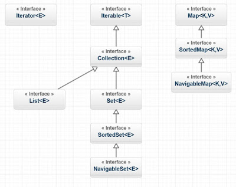

# Java Collections

## Что такое Коллекция

Коллекции - это хранилища или контейнеры, поддерживающие различные способы накопления и упорядочения объектов с целью обеспечения возможностей эффективного доступа к ним. Они представляют собой реализацию абстрактных структур данных, поддерживающих три основные операции:
добавление нового элемента в коллекцию:

- Удаление элемента из коллекции
- Изменение элемента в коллекции

## Назовите основные интерфейсы коллекций и их имплементации

`Сollection` расширяет три интерфейса: `List`, `Set`, `Queue`.

`List` - хранит упорядоченные елементы(могут быть одинаковые). Имеет такие реализации как `LinkedList`, `ArrayList` и `Vector`.

- `Vector` синхронизирован, и по этому в одном потоке, он работает медленней остальных реализаций.
- `ArrayList` - его преимущество в навигации по коллекции.
- `LinkedList` - Его преимущество в во вставке и удалении элементов в коллекции.

`Set` - коллекции, которые не содержат повторяющихся элементов. Основные реализации: `HashSet`, `TreeSet`, `LinkedHashSet`

- `TreeSet` - упорядочивает элементы по их значениям;
- `HashSet` - упорядочивает элементы по их хэш ключах, хотя на первый взляд может показаться что элементы хранятся в случайном порядке.
- `LinkedHashSet` - хранит элементы в порядке их добавления

`Queue` - интерфейс для реализации очереди в джава.
Основные реализации: `LinkedList`, `PriorityQueue`.
Очереди работают по принципу **FIFO – first in first out**.

`Map` - интерфейс для реализации так называемой карты, где элементы хранятся с их ключами. Основные реализации: `HashTable`, `HashMap`, `TreeMap`, `LinkedHashMap`

`HashTable` - синхронизированна, объявлена уставревшей.
`HashMap` - порядок елементов рассчитывается по хэш ключу;
`TreeMap` - элементы хранятся в отсортированном порядке
`LinkedHashMap` - элементы хранятся в порядке вставки

Ключи в `Мар` не могут быть одинаковыми!
Синхронизировать не синхронизированные коллекции и карты можно посредством класса `Collections.synchronizedMap(MyMap)`, `synchronizedList(MyList)`.

### Чем отличается `ArrayList` от `LinkedList`? В каких случаях лучше использовать первый, а в каких второй

Отличие заключается в способе хранения данных. `ArrayList` хранит в виде массива, а `LinkedList` - в виде списка (двунаправленного).

В `ArrayList` быстрее происходит сортировка, т.к. для ее выполнения данные списка копируются в массив (а копировать из массива `ArrayList` в массив для сортировки быстрее).

При большом числе операций добавления и удаления `LinkedList` должен быть более удачным выбором, т.к. при этих операциях не приходится перемещать части массива.
Если при добавлении в `ArrayList` превышается его объем, размер массива увеличивается, новая емкость рассчитывается по формуле **`(oldCapacity * 3) / 2 + 1`**, поэтому лучше указывать размер при создании или, если он не известен, использовать LinkedList (но это может быть существенно при слишком уж больших объемах данных).

### Чем отличается `HashMap` от `Hashtable`

Класс `HashMap` по функционалу очень похож на `Hashtable`. Главное отличие в том, что методы класса `Hashtable` синхронизированы, а `HashMap` - нет. Кроме этого класс `HashMap` в отличии от `Hashtable` разрешает использование `null` в качестве ключей и значений.

Наличие синхронизации в `Hashtable` уменьшает производительность кода, использующегоданный класс. Поэтому классы **JCF** (Java Collections Framework, появившийся в Java 2), втом числе и `HashMap`, несинхронизированы. Если синхронизация все же нужна, можноиспользовать методы класса `Collections`: `Collections.synchronizedMap(map)`,`Collections.synchronizedList(list)` или `Collections.synchronizedSet(set)`.
Данные методы возвращают синхронизированный декоратор переданной коллекции. При этом всеравно в случае итерирования по коллекции требуется ручная синхронизация.

Начиная с Java 6 **JCF** был расширен специальными коллекциями, поддерживающимимногопоточный доступ, такими как `CopyOnWriteArrayList` и `ConcurrentHashMap`.

### Чем отличается `ArrayList` от `Vector`

Методы класса `Vector` синхронизированы, в то время как `ArrayList` - нет.

## Как сравниваются елементы коллекций

Для сравнения элементов коллекций  используется метод `equals()` и `hashcode()`. Эти методы унаследованы от класса `Object`.

- Если наш пользовательский класс  переопределяет `equals()`, то он должен и переопределить `hashcode()`
- Если  два объекта эквивалентны, то и  хэш коды этих объектов тоже должны быть равны
- Если  поле не используется в `equals()`, то оно и не должно использоваться в `hashcode()`

## Расположите в виде иерархии следующие интерфейсы: `List`, `Set`, `Map`, `SortedSet`,  `SortedMap`, `Collection`,`Iterable`, `Iterator`, `NavigableSet`, `NavigableMap`



## Почему `Map` - это не `Collection`, в то время как `List` и `Set` являются `Collection`

Коллекция (`List` и `Set`) представляет собой совокупность некоторых элементов (обычно экземпляров одного класса).`Map` -это совокупность пар "ключ"-"значение".
Соответственно некоторые методы интерфейса `Collection` нельзя использовать в `Map`. Например, метод `remove(Object o)` в интерфейсе `Collection` предназначен для удаления элемента, тогда как такой же метод `remove(Object key)` в интерфейсе `Map` - удаляет элемент по заданному ключу.

## Дайте определение понятию `Iterator`

Итератор - объект, позволяющий перебирать элементы коллекции. Например foreach реализован с использованием итератора. Одним из ключевых методов интерфейса Collection является метод `Iterator<E>` iterator(). Он возвращает итератор - то есть объект, реализующий интерфейс Iterator.
Интерфейс Iterator имеет следующее определение:

```Java
public interface Iterator<E> {
    E next();
    boolean hasNext();
    void remove();
}
```

### Что вы знаете об интерфейсе `Iterable`

Все коллекции из java.util реализуют интерфейс Collection, который, в свою очередь, расширяет интерфейс Iterable. В интерфейсе Iterable описан только один метод:
Iterator iterator();
Он возвращает Iterator, т.е. объект, который поочерёдно возвращает все элементы коллекции.

## Как одной строчкой преобразовать `HashSet` в `ArrayList`

```Java
public static void main(String... args) {
    Set<String> set = new HashSet<>();
    set.add("A");
    set.add("B");
    List<String> list = new ArrayList<>(set);
}
```

## Как одной строчкой преобразовать `ArrayList` в `HashSet`

```Java
public static void main(String... args) {
    List<String> list = new ArrayList<>();
    list.add("A");
    list.add("B");
    Set<String> list = new HashSet<>(list);
}
```

## Как перебрать все ключи и/или значения `Map` учитывая, что `Map` - это не `Iterable`

Использовать метод `keySet()`, который возвращает множество `Set<K>` ключей для перебора.

Использовать метод `values()`, который возвращает коллекцию `Collection<V>` значений для перебора.

Использовать метод `entrySet()`, который возвращает множество `Set<Map.Entry<K, V>` пар *ключ-значение*.

## В чем проявляется “сортированность” `SortedMap`, кроме того, что `toString()` выводит все по порядку

Естественное упорядочивание (natural ordering) отражается при итерации по коллекции ключей или значений хэш-таблицы (возвращаемых методами `keySet()`, `values()` и `entrySet()`).

## Как одним вызовом копировать элементы из любой Collection в массив

```Java
public static void main(String... args) {
    List<String> list = new ArrayList<>();
    list.add("A");
    list.add("B");

    String[] strArr = list.toArray(new String[list.size()]);
    // OR
    Object[] objArr = list.toArray();
}
```

## Реализуйте симметрическую разность двух коллекций используя методы `Collection` `addAll()`, `removeAll()`, `retainAll()`

Симметрическая разность двух коллекций - это множество элементов, одновременно не принадлежащих обоим исходным коллекциям.

```Java
public static <T> Collection<T> symmetricDifference(Collection<T> a, Collection<T> b) {
    // Создаем новую коллекцию, чтобы не изменять исходные
    Collection<T> intersection = new ArrayList<>(a)
    // Получаем пересечение коллекций
    intersection.retainAll(b);
    Collection<T> result = new ArrayList<>(a);
    // Объеденяем коллекции
    result.addAll(b);
    // Удаляем элементы, расположеннные в обоих коллекциях
    result.removeAll(intersection);

    return result;
}

public static void main(String... args) {
    List<String>a = new ArrayList<>(Arrays.asList("1", "2", "3", "4", "5"))
    List<String>a = new ArrayList<>(Arrays.asList("3", "4", "5", "6", "7"))
    Collection<String> c symmetricDifference(a, b);
     System.out.println("Collection a" + Arrays.toString(a.toArray()));
     System.out.println("Collection b" + Arrays.toString(b.toArray()));
     System.out.println("Collection c" + Arrays.toString(c.toArray()));
```

## Сравните `Enumeration` и `Iterator`

Оба интерфейса предназначены для обхода коллекций. Интерфейс `Iterator` был введен несколько позднее в Java Collections Framework и его использование предпочтительнее.
Основные различия `Iterator` по сравнению с `Enumeration`:

- Наличие метода `remove()` для удаления элемента из коллекции при обходе;
- Исправлены имена методов для повышения читаемости кода.

## Как между собой связаны Iterable и Iterator

Интерфейс `Iterable` имеет только один метод - `iterator()`, который возвращает итератор коллекции для её обхода.

### Как между собой связаны Iterable, Iterator и «for-each» введенный в Java 5

Экземпляры классов, реализующих интерфейс `Iterable`, могут использоваться в конструкции `foreach`.

## Сравните `Iterator` и `ListIterator`

`ListIterator` расширяет интерфейс `Iterator`, позволяя клиенту осуществлять обход коллекции в обоих направлениях, изменять коллекцию и получать текущую позицию итератора.
При этом важно помнить, что `ListIterator` не указывает на конкретный элемент, а его текущая позиция располагается между элементами, которые возвращают методы `previous()` и `next()`. Таким образом, модификация коллекции осуществляется для последнего элемента, который был возвращен методами `previous()` и `next()`.

## Что произойдет, если я вызову `Iterator.next()` не «спросив» `Iterator.hasNext()`

Если итератор указывает на последний элемент коллекции, то возникнет исключение `NoSuchElementException`, иначе будет возвращен следующий элемент.

## Что произойдет, если я вызову `Iterator.next()` перед этим 10 раз вызвав  `Iterator.hasNext()`? Я пропущу 9 элементов

Нет, `hasNext()` осуществляет только проверку наличия следующего элемента.

## Если у меня есть коллекция и порожденный итератор, изменится ли коллекция, если я вызову `iterator.remove()`

Вызов метода `iterator.remove()` возможен только после вызова метода `iterator.next()` хотя бы раз, иначе появится исключение `IllegalStateException`.
Если `iterator.next()` был вызван прежде, то `iterator.remove()` удалит элемент, на который указывает итератор.

## Если у меня есть коллекция и порожденный итератор, изменится ли итератор, если я вызову `collection.remove()`

Итератор не изменится, но при следующем вызове его методов возникнет исключение `ConcurrentModificationException`

## Зачем добавили `ArrayList`, если уже был `Vector`

Обе структуры данных предназначены для хранения коллекции элементов, в том числе дупликатов и `null`. Они основаны на использовании массивов, динамически расширяющихся при необходимости.
Класс `Vector` был введен в JDK 1.0 и не является частью Java Collection Framework. Методы класса `Vector` синхронизированы, что обеспечивает потокобезопасность, но это приводит к снижению производительности, поэтому и был введен класс `ArrayList`, методы которого не синхронизированы.

## В реализации класса `ArrayList` есть следующие поля: `Object[] elementData`, `int size`. Объясните, зачем хранить отдельно `size`, если всегда можновзять `elementData.length`

Размер массива `elementData` представляет собой вместимость (capacity) `ArrayList`, которая всегда больше переменной `size` - реального количества хранимых элементов. С добавлением новых элементов вместимость автоматически возрастает при необходимости.

## `LinkedList` - это односвязный, двусвязный или четырехсвязный список

Двухсвязный список: каждый элемент `LinkedList` хранит ссылку на предыдущий и следующий элементы.

## Какое худшее время работы метода `contain()` для элемента, который есть в `LinkedList`, `ArrayList` (`O(1)`, `O(log(N))`, `O(N)`, `O(N*log(N))`, `O(N*N)`)

`O(N)`. Время поиска элемента линейно пропорционально количеству элементов с списке.

## Какое худшее время работы метода `add()` для `LinkedList` (`O(1)`, `O(log(N))`, `O(N)`, `O(N*log(N))`, `O(N*N)`)

`O(N`). Здесь стоит заметить, что добавление элемента в конец списка с помощью методом `add(value)`, `addLast(value)` и добавление в начало списка с помощью `addFirst(value)` выполняется за время `O(1)`.
`O(N)` - будет при добавление элемента в отсортированный список, а также при добавлении элемента с помощью метода `add(index, value)`.

## Какое худшее время работы метода `add()` для `ArrayList` (`O(1)`, `O(log(N))`, `O(N)`, `O(N*log(N))`, `O(N*N)`)

`O(N)`. Вставка элемента в конец списка осуществляется за время `O(1)`, но если вместимость массива недостаточна, то происходит создание нового массива с увеличенным размером и копирование всех элементов из старого массива в новый.

Сколько выделяется элементов в памяти при вызове `ArrayList.add()`

Если в массиве достаточно места для размещения нового элемента, то дополнительное место в памяти не выделяется. Иначе происходит создание нового массива с размером:

```Java
int oldCapacity = elementData.length;
int newCapacity = oldCapacity + (oldCapacity >> 1);
```

Другими словами, создается новый массив, размер которого вычисляется как умножение старого размера на 1.5 (это верно для JDK 1.7, в более ранних версиях вычисления отличаются).

## Сколько выделяется элементов в памяти при вызове `LinkedList.add()`

Создается один новый экземпляр вложенного класса `Node`

## Оцените количество памяти на хранение одного примитива типа `byte` в  `LinkedList`

Каждый элемент `LinkedList` хранит ссылку на предыдущий элемент, следующий элемент и ссылку на данные. Для x32 систем каждая ссылка занимает 32 бита (4 байта). Сам объект типа `Node` занимает приблизительно 8 байт. Размер каждого объекта в Java кратен 8, соответственно получаем 24 байта. Примитив типа `byte` занимает 1 байт памяти, но в списке примитивы упаковываются, соответственно получаем еще 8 байт. Таким образом, в x32 JVM около 32 байтоввыделяется для хранения одного значения типа `byte` в `LinkedList`.
Для 64-битной JVM каждая ссылка занимает 64 бита (8 байт). Вычисления аналогичны.

## Оцените количество памяти на хранение одного примитива типа `byte` в `ArrayList`

`ArrayList` основан на массиве. Каждый элемент массива хранит примитивный тип данных - `byte`, размер которого 1 байт.

## Я добавляю элемент в середину `List`: `list.add(list.size()/2, newElem)`. Для кого эта операция медленнее — для `ArrayList` или для `LinkedList`

Для `ArrayList`:

- проверка массива на вместимость. Если вместимости недостаточно, то - увеличение размера массива и копирование всех элементов в новый массив `O(N)`;
- копирование всех элементов, расположенных правее от позиции вставки, на одну позицию вправо ( `O(N/2)`);
- вставка элемента `O(1)`.

Для `LinkedList`:

- поиск позиции вставки `O(N/2)`;
- вставка элемента `O(1)`.

В худшем случае вставка в середину списка эффективнее для `LinkedList`. В остальных - скорее всего, для `ArrayList`, поскольку копирование элементов осуществляется за счет системного метода `System.arraycopy()`.

## Как перебрать элементы `LinkedList` в обратном порядке, не используя медленный `get(index)`

Использовать обратный итератор. Для этого в `LinkedList` есть метод `descendingIterator()`

## Как одним вызовом из `List` получить `List` со всеми элементами, кроме первых и последних 3-х

```Java
List<Integer> sourceList = new ArrayList<>(Arrays.asList(1, 2, 3, 4, 5, 6, 7, 8, 9));
List<Integer> subList = sourceList.subList(3, sourceList.size( - 3));
```

## Могут ли у разных объектов в памяти `ref0 != ref1` быть `ref0.hashCode() == ref1.hashCode()`

Да, могут. Метод `hashCode()` не гарантирует уникальность возвращаемого значения

## Могут ли у разных объектов в памяти `ref0 != ref1` быть `ref0.equals(ref1) == true`

Да, могут. Для этого в классе этих объектов должен быть переопределен метод `equals()`.
Если используется метод `Object.equals()`, то для двух ссылок x и y метод вернет `true` тогда и только тогда, когда обе ссылки указывают на один и тот же объект (т.е. `x == y` возвращает `true`).

## Могут ли у разных ссылок на один объект в памяти `ref0 == ref1` быть  `ref0.equals(ref1) == false`

Нет, не может. Метод `equals()` должен гарантировать свойство рефлексивности: для любых ненулевых ссылок метод `x.equals(x)` должен возвращать `true`.

## Есть класс `Point{int x, y;}`. Почему хэш-код в виде `31 * x + y` предпочтительнее чем `x + y`

Множитель создает зависимость значения хэш кода от очередности обработки полей, а это дает гораздо лучшую хэш функцию.

### Если у класса `Point{int x, y;}` «правильно» реализовать метод `equals` (`return ref0.x == ref1.x && ref0.y == ref1.y`), но сделать хэш-код в виде `int hashCode() {return x;}`, то будут ли корректно такие точки помещаться и извлекаться из `HashSet`

`HashSet` использует `HashMap` для хранения элементов (в качестве ключа используется сам объект). При добавлении элемента в `HashMap` вычисляется хэшкод и позиция в массиве, куда будет вставлен новый элемент. У всех экземпляров класса `Point` одинаковый хэшкод, что приводит в вырождению хэш-таблицы в список. При возникновении коллизии осуществляется проверка на наличие уже такого элемента в текущем списке:

```Java
e.hash == hash && ((k = e.kay) == key || key.equals(k));
```

Если элемент найден, то его значение перезаписывается. В нашем случае для разных объектов метод `equals()` будет возвращать `false`. Соответственно новый элемент будет добавлен в `HashSet`. Извлечение элемента также будет осуществляться успешно.
Но производительность такого кода будет низкой и преимущества хэш-таблиц использоваться не будут.

## `equals()` порождает отношение эквивалентности. Какими из свойств обладает такое отношение: коммутативность, симметричность, рефлексивность, дистрибутивность, ассоциативность, транзитивность

Метод `equals()` должен обеспечивать:

- симметричность (для любых ненулевых ссылок x и y метод `x.equals(y)` должен возвращать `true` тогда и только тогда, когда `y.equals(x)` возвращает `true`)
- рефлексивность (для любых ненулевых ссылок x метод `x.equals(x)` должен возвращать `true`.)
- транзитивность (для любых ненулевых ссылок x, y и z, если `x.equals(y)` возвращает `true` и `y.equals(z)` возвращает `true`, тогда и `x.equals(z)` должен возвращать `true`).

Также есть ещё два свойства: постоянство и неравенство `null`.

## Можно ли так реализовать `equals(Object that) {return this.hashCode() == that.hashCode()}`

Строго говоря нельзя, поскольку метод `hashCode()` не гарантирует уникальность значения для каждого объекта. Однако для сравнения экземпляров класса `Object` такой код допустим, т.к. метод  `hashCode()` в классе `Object` возвращает уникальные значения для разных объектов (вычисления основаны на использовании адреса объекта в памяти).

## В `equals` требуется проверять, что аргумент `equals(Object that)` такого же типа как и сам объект. В чем разница между `this.getClass() == that.getClass()` и `that instanceof MyClass`

Оператор `instanceof` сравнивает объект и указанный тип. Его можно использовать для проверки является ли данный объект экземпляром некоторого класса, либо экземпляром его дочернего класса, либо экземпляром класса, который реализует указанный интерфейс.
`getClass() = ...` проверяет два типа на идентичность.

Для корректной реализации контракта метода `equals()` необходимо использовать точное сравнение с помощью `getClass()`.

## Можно ли реализовать метод `equals` класса `MyClass` вот так: `class MyClass {public boolean equals(MyClass that) {return this == that;}}`

Реализовать можно, но данный метод не переопределяет метод `equals()` класса `Object`, а перегружает его.

## Будет ли работать `HashMap`, если все ключи будут возвращать `int hashCode() {return 42;}`

Да, будет. Но тогда хэш-таблица вырождается в связный список и теряет свои преимущества.

## Зачем добавили `HashMap`, если уже был `Hashtable`

Класс `Hashtable` был введен в JDK 1.0 и не является частью Java Collection Framework. Методы класса `Hashtable` синхронизированы, что обеспечивает потокобезопасность, но это приводит к снижению производительности, поэтому и был введен класс `HashMap`, методы которого не синхронизированы.
Помимо этого класс `HashMap` обладает некоторыми другими отличиями: например, позволяет хранить один `null` ключ и множество `null` значений.

## Согласно Кнуту и Кормену существует две основных реализации хэш-таблицы: на основе открытой адресацией и на основе метода цепочек. Как реализована `HashMap`? Почему так сделали (по вашему мнению)? В чем минусы и плюсы каждого подхода

Класс `HashMap` реализован с использованием метода цепочек, т.е. каждой ячейке массива соответствует свой связный список и при возникновении коллизии осуществляется добавление нового элемента в этот список.

Для метода цепочек коэффициент заполнения может быть больше 1, с увеличением числа элементов производительность убывает линейно. Такие таблицы удобно использовать, если заранее неизвестно количество хранимых элементов, либо их может быть достаточно много, что приводит к большим значениям коэффициента заполнения.

Среди методов открытой реализации различают:

- линейное пробирование
- квадратичное пробирование
- двойное хеширование

Основные недостатки структур с методом открытой адресации:

- Количество элементов в таблице не может превышать размера массива. По мере увеличения числа элементов в таблице и повышения коэффициента заполнения (load factor) производительность структуры резко падает, поэтому необходимо проводить перехеширование.
- Сложно организовать удаление элемента.
- Также первые два метода открытой адресации приводят к проблеме первичной и вторичной группировок.

Основное преимущество хэш-таблицы с открытой адресацией - это отсутствие затрат на создание и хранение объектов списка. Также проще организовать сериализацию/десериализацию объекта.

## Сколько переходов по ссылкам происходит, когда вы делаете `HashMap.get(key)` по ключу, который есть в таблице

Возможно, я неправильно понял этот вопрос. За переходы по ссылке в данном ответе я считаю вызовы методов.

```Java
public V get(Object key) {
    if (key == null) {
        return getForNullKey();
    }
    Entry<K, V> entry = getEntryKey(key);

    return null == entry ? null : entry.getValue();
}
```

Рассмотрим первый случай, когда ключ равен null: выполняем метод getForNullKey().

```Java
public V get(Object key) {
    if (size == 0) {
        return null;
    }
    for (Entry<K, V> e = tabke[0]; e != null; e = e.next) {
        if (e.key == null)
            return e.value;
    }
    return null;
}
```

В цикле foreach проходимся по списку значений для ключа и возвращаем нужное значение. Таким образом, получаем 1 переход.
Второй случай: ключ не равен null. Выполняем метод getEntry(key).

```Java
final Entry<K, V> getEntry(Oject key) {
    if (size == 0) {
        return null;
    }

    int hash = (key == null) ? 0 : hash(key);
    for (Entry<K, V> e table[indexFor(hash, table.length)]; e != null; e = e.next) {
        Object k;
        if (e.hash == hash && ((k = e.key) == key || (key != null && key.equals(k)))) {
            return e;
        }
    }
    return null;
}
```

Вычисляется хэш-код ключа (метод `hash(key)`), затем определяется индекс ячейки массива, в которой будем искать значение метод `indexFor(hash, table.length)`.
После того, как нашли нужную пару "ключ-значение" возвращаем значение метод `entry.getValue()`. Таким образом, получаем 4 перехода.

## Сколько создается новых объектов, когда вы добавляете новый элемент в `HashMap`

Один новый объект статического вложенного класса `Entry<K,V>`

## Как работает `HashMap` при попытке сохранить в нее два элемента по ключам с одинаковым `hashCode`, но для которых `equals == false`

По значению `hashCode` вычисляется индекс ячейки массива, в список которой будет происходить добавление элемента. Перед добавлением осуществляется проверка на наличие уже элементов в этой ячейке. Если элементов нет, то происходит добавление. Если возникает коллизия, то итеративно осуществляется обход списка в поисках элемента с таким же ключом и хэш-кодом. Если такой элемент найден, то его значение перезаписывается, а старое - возвращается. Поскольку в условии сказано, что добавляемые ключи - разные, то второй элемент будет добавлен в начало списка.

## `HashMap` может выродиться в список даже для ключей с разным `hashCode`. Как это возможно

Это возможно в случае, если метод, определяющий номер ячейки массива по `hashCode` будет возвращать одинаковое значение

## Какое худшее время работы метода `get(key)` для ключа, которого нет в таблице `O(1)`, `O(log(N)`), `O(N)`, `O(N*log(N))`, `O(N*N)`

`O(N)`. Худший случай - это поиск ключа в таблице, вырожденной в список, перебор ключей которой занимает линейно пропорциональное время количеству хранимых элементов.

## Какое худшее время работы метода `get(key)` для ключа, который есть в таблице `O(1)`, `O(log(N))`, `O(N)`, `O(N*log(N))`, `O(N*N)`

`O(N)`. Аналогичные рассуждения, что и для предыдущего вопроса.

## Объясните смысл параметров в конструкторе `HashMap(int initialCapacity, float loadFactor)`

`int initialCapacity` - исходный размер `HashMap` (количество корзин в хэш-таблице в момент её создания), по умолчанию имеет значение 16.
`float loadFactor` - коэффициент заполнения `HashMap`. Равен отношению числа хранимыхэлементов в таблице к её размеру. `loadFactor` - является мерой заполнения таблицыэлементами, при превышении количества хранимых таблицей значений , происходитавтоматическое перехеширование. Значение по умолчанию 0.75 является хорошим компромиссоммежду временем доступа и объемом хранимых данных.

## В чем разница между `HashMap` и `IdentityHashMap`? Для чего нужна `IdentityHashMap`? Как может быть полезна для реализации сериализации или клонирования

`IdentityHashMap` - это структура данных, реализующая интерфейс `Map`, но использующая сравнение ссылок вместо метода `equals()` при сравнении ключей (значений). Другими словами, в `IdentityHashMap` два ключа k1 и k2 будут рассматриваться равными, если выполняется условие k1 == k2.
`IdentityHashMap` не использует метод `hashCode()`, вместо которого применяется метод `System.identityHashCode(Object)`.
Другое отличие (как следствие) заключается в более высокой производительности `IdentityHashMap` по сравнению с `HashMap`, если последний хранит объекты с дорогостоящими методами `equals()` и `hashCode()`.
Одним из основных требований к использованию `HashMap` является неизменяемость
ключа, однако это требование не распространяется на `IdentityHashMap`, который не использует методы `equals()` и `hashCode()`.
Согласно документации, такая структура данных может применяться для реализации сериализации/клонирования. Для выполнения подобных алгоритмов программе необходимо обслуживать таблицу со всеми ссылками на объекты, которые уже были обработаны. Такая таблица не должна рассматривать уникальные объекты как равные, даже если метод `equals()` возвращает `true`.

### В чем разница между `HashMap` и `WeakHashMap`? Для чего нужна `WeakHashMap`

Перед рассмотрением `WeakHashMap` кратко напомню, что такое *WeakReference*. В Java существует 4 типа ссылок: сильные (strong reference), мягкие (SoftReference), слабые (WeakReference) и фантомные (PhantomReference). Особенности каждого типа ссылок связаны с работой Garbage `Collector`. Если объект можно достичь только с помощью цепочки WeakReference (то есть на него не ссылаются сильные и мягкие ссылки), то данный объект будет отмечен для удаления.

`WeakHashMap` - это структура данных, реализующая интерфейс `Map` и основанная на использовании WeakReference для хранения ключей. Таким образом, пара "ключ-значение" будет удалена из WeakHashMap, если на объект-ключ более не имеется сильных ссылок.

В качестве примера использования такой структуры данных можно привести следующую ситуацию: допустим имеются объекты, которые необходимо расширить дополнительной информацией, при этом изменение класса этих объектов нежелательно либо невозможно. В этом случае добавляем каждый объект в `WeakHashMap` в качестве ключа, а в качестве значения - нужную информацию. Таким образом, пока на объект имеется сильная ссылка (либо мягкая), можно проверять хэш-таблицу и извлекать информацию. Как только объект будет удален, то WeakReference для этого ключа будет помещен в `ReferenceQueue` и затем соответствующая запись для этой слабой ссылки будет удалена из `WeakHashMap`.

### В `WeakHashMap` используются WeakReferences. А почему бы не создать `SoftHashMap` на SoftReferences

`SoftHashMap` представлена в стронних библиотеках, например, в Apache Commons.

## В `WeakHashMap` используются WeakReferences. А почему бы не создать `PhantomHashMap` на PhantomReferences

PhantomReference при вызове метода `get()` возвращает всегда `null`, поэтому, я думаю, создание `PhantomHashMap` просто невозможно. Плюс назначение такой структуры данных тяжело представить.

### Сделайте `HashSet` из `HashMap` (используйте только множество ключей, но не множество значений)

```Java
Set<Objct> keySet = new HashSet<>(map.keySet());
```

### Сделайте `HashMap` из `HashSet` `HashSet<Map.Entry<K, V>>`

```Java
Map<K, V> map = new HashMap<>(set.size());
for (Map.Entry<K, V> entry : set) {
    map.put(etry.getKey(), entry.getValue());
}
```

## Сравните интерфейсы `java.util.Queue` и `java.util.Deque`

Согласно документации `Deque` ("дек", Double Ended Queue) - это линейная коллекция, поддерживающая вставку/извлечение элементов с обоих концов. Помимо этого реализации интерфейса `Deque` могут строится по принципу FIFO, либо LIFO.

`Queue` - это очередь, обычно (но необязательно) строится по принципу FIFO (First-In-First-Out) - соответственно извлечение элемента осуществляется с начала очереди, вставка элемента - в конец очереди. Этот принцип нарушает, к примеру, приоритетная очередь `PriorityQueue`, использующая переданный comparator при вставке нового элемента, либо расстановка элементов осуществляется согласно естественному упорядочиванию (natural ordering).
`Deque` расширяет `Queue`.
Реализации и `Deque`, и `Queue` обычно не переопределяют методы `equals()` и `hashCode()`, основанные на сравнении хранящихся элементов. Вместо этого используются унаследованные методы класса `Object`, основанные на сравнении ссылок.

## Кто кого расширяет: `Queue` расширяет `Deque`, или `Deque` расширяет `Queue`

`Deque` расширяет `Queue`.

## Почему `LinkedList` реализует и `List`, и `Deque`

`LinkedList` позволяет добавлять элементы в начало и конец списка за константное время, что хорошо подходит для реализации интерфейса `Deque` (в отличие, например, от `ArrayList`).

## В чем разница между классами `java.util.Arrays` и `java.lang.reflect.Array`

- `java.util.Arrays` - класс, содержащий статические методы для работы с массивами, таких как, например, поиск по массиву и его сортировка.

- `java.lang.reflect.Array` - класс для работы с массивами при использовании рефлексии. Рефлексия - это механизм, позволяющий исследовать данные о программе во время её выполнения.

## В чем разница между классами `java.util.Collection` и `java.util.Collections`

Класс `java.util.Collections` содержит исключительно статические методы для работы с коллекциями. В них входят методы, реализующие полиморфные алгоритмы (такие алгоритмы, использование которых возможно с разными видами структур данных), "оболочки", возвращающие новую коллекцию с инкапсулированной указанной структурой данных и некоторые другие методы.

`java.util.Collection` - это корневой интерфейс Java Collections Framework. Этот интерфейс в основном применяется там, где требуется высокий уровень абстракции, например, в классе `java.util.Collections`.

## Напишите не многопоточную программу, которая заставляет коллекцию выбросить `ConcurrentModificationException`

```Java
List<String> stringList = new ArrayList<>();
stringList.add("1");
stringList.add("2");
stringList.add("3");

Iterator<String> listIterator = stringList.iterator();
stringList.remove("2");
while (listIterator.hasNext()) {
    System.out.println(listIterator.next());
}
```

## Что такое “fail-fast поведение”

Fail-fast поведение означает, что при возникновении ошибки или состояния, которое может привести к ошибке,система немедленно прекращает дальнейшую работу и уведомляет об этом.

В Java Collections API итераторы могут использовать либо fail-fast, либо fail-safe поведение, либо быть weakly consistent. Итератор с fail-fast поведением выбросит исключение `ConcurrentModificationException`, если после его создания была произведена модификация коллекции, т.е. добавлен или удален элемент (без использования метода `remove()` итератора). Реализация такого поведения осуществляется за счет подсчета количества модификаций коллекции (modification count):
при изменении коллекции (удаление/добавление элемента) счетчик увеличивается;
при создании итератора ему передается текущее значение счетчика;
при каждом обращении к итератору сохраненное значение счетчика сравнивается с текущим, и, если они не совпадают, возникает исключение.
Использование fail-fast подхода позволяет избежать недетерминированного поведения программы в течение времени. Также стоит отметить, что fail-fast поведение не может быть абсолютно гарантировано.

## Для множеств еnum-ов есть специальный класс `java.util.EnumSet`? Зачем? Чем авторов не устраивал `HashSet` или `TreeSet`

`EnumSet` - это одна из разновидностей реализации интерфейса `Set` для использования с перечислениями (`Enum`). `EnumSet` использует массив битов для хранения значений (bit vector), что позволяет получить высокую компактность и эффективность.

В структуре данных хранятся объекты только одного типа `Enum`, который указывается при создании экземпляра `EnumSet`. Все основные операции выполняются за константное время `O(1)` и в основном несколько быстрее (хотя и негарантированно), чем их аналоги в реализации `HashSet`. Пакетные операции bulk operations, например, `containsAll()` и `retainAll()` выполняются очень быстро, если их аргументом является экземпляр типаEnum.

Помимо этого класс `EnumSet` предоставляет множество статических методов инициализации для упрощенного и удобного создания экземпляров.
Итерация по `EnumSet` осуществляется согласно порядку объявления элементов перечисления.

## `java.util.Stack` - считается «устаревшим». Чем его рекомендуют заменять? Почему

Рекомендуется использовать интерфейс `Deque` ("дек", Double Ended Queue) и его реализации. Например:

```Java
Deque<Integer> stack = new ArrayDeque<Integer>();
```

Стек - это структура данных, построенная на принципе LIFO (Last-In-First-Out, либо по-другому FILO). Каждое новое значение добавляется на "вершину" стека, а извлекается последний добавленный элемент (с "вершины" стека). При извлечении элемента он удаляется из структуры данных.
Класс Stack появился в JDK 1.0 и расширяет класс `Vector`, наследуя его функционал, что несколько нарушает понятие стека (например, класс `Vector` предоставляет возможность обращаться к любому элементу по индексу). Также использование `Deque` позволяет следовать принципу программирования на уровне интерфейсов, а не конкретных реализаций, что облегчает дальнейшую поддержку разрабатываемого класса и повышает его гибкость, позволяя при необходимости менять реализацию дека на нужную.

## Какая коллекция реализует дисциплину обслуживания FIFO

FIFO - First-In-First-Out (первый пришел, первым ушел). По этому принципу обычно построена такая структура данных как очередь (`java.util.Queue`).

## Какая коллекция реализует дисциплину обслуживания FILO

FILO - First-In-Last-Out (первый пришел, последним ушел). По этому принципу построена такая структура данных как стек (`java.util.Stack`).

## Приведите пример, когда какая-либо коллекция выбрасывает `UnsupportedOperationException`

```Java
List fixedList = Arrays.asList("1", "2", "3");
Iterator<String> listIterator = fixedList.iterator();
while (iterator.hasNext()) {
    String currentElement = iterator.next();
    if ("2".equals(currentElement)) {
        iterator.remove();
    }
}
```

В данном примере возникнет исключение `UnsupportedOperationException`, поскольку метод `asList()` возвращает список фиксированной длины, т.е. удаление/добавление элементов в такой список не поддерживается.

## Почему нельзя написать `ArrayList<List> numbers = new ArrayList<ArrayList>();` но можно `List<ArrayList> numbers = new ArrayList<ArrayList>();`

Это связано с ограничениями использования generic types (обобщенных типов). `ArrayList<ArrayList>` не является подтипом `ArrayList<List>`, соответственно использование такой записи запрещено.

## `LinkedHashMap` - что это еще за «зверь»? Что в нем от `LinkedList`, а что от `HashMap`

Реализация `LinkedHashMap` отличается от `HashMap` поддержкой двухсвязанного списка, определяющего порядок итерации по элементам структуры данных. По умолчанию элементы списка упорядочены согласно их порядку добавления в `LinkedHashMap` (insertion-order). Однако порядок итерации можно изменить, установив параметр конструктора accessOrder в значение `true`. В этом случае доступ осуществляется по порядку последнего обращения к элементу (access-order). Это означает, что при вызове методов `get()` или `put()` элемент, к которому обращаемся, перемещается в конец списка.
При добавлении элемента, который уже присутствует в `LinkedHashMap` (т.е. с одинаковым ключом), порядок итерации по элементам не изменяется.

## `LinkedHashSet` - что это еще за «зверь»? Что в нем от `LinkedList`, а что от `HashSet`

Реализация `LinkedHashSet` отличается от `HashSet` поддержкой двухсвязанного списка, определяющего порядок итерации по элементам структуры данных. Элементы списка упорядочены согласно их порядку добавления в `LinkedHashSet` (insertion-order).
При добавлении элемента, который уже присутствует в `LinkedHashSet` (т.е. с одинаковым ключом), порядок итерации по элементам не изменяется.

## Говорят, на `LinkedHashMap` легко сделать простенький кэш c *invalidation policy*, знаете как

Необходимо использовать LRU-алгоритм (Least Recently Used algorithm) и `LinkedHashMap` с access-order. В этом случае при обращении к элементу он будет перемещаться в конец списка, а наименее используемые элементы будут постепенно группироваться в начале списка.
Для этого в стандартной реализации `LinkedHashMap` (source) есть метод
`removeEldestEntries()`, который возвращает true, если текущий объект `LinkedHashMap`
должен удалить наименее используемый элемент из коллекции. Метод вызывается при использовании методов `put()` и `putAll()`:

```Java
void addEntry(int hash, K key, V value, int bucketIndex) {
    createEntry(hash, key, value, bucketIndex);

    Entry<K, V> eldest = header.after;
    if (removeEldestEntry(eldest)) {
        removeEntryForKey(eldest.key);
    } else {
        if (size >= treshold) {
            resize(2 * table.length);
        }
    }
}
```

Простой пример реализации кэша с очисткой старых значений при превышении указанного порога:

```Java
public class LRUChache<K, V> extends LinkedHashMap<K, V> {
    private static final int MAX_ENTIRES = 10;

    public LRUChache(int initialCapacity) {
        super(initialCapacity, 0,85f, true);
    }

    @Override
    protected boolean removeEldestEntry(Map.Entry<K, V> eldest) {
        return size() > MAX_ENRIES;
    }
}
```

Стоит заметить, что `LinkedHashMap` не позволяет полностью реализовать LRU-алгоритм, поскольку при вставке уже имеющегося в коллекции элемента порядок итерации не меняется.

## Что позволяет сделать PriorityQueue

`PriorityQueue` - это структура данных, располагающая элементы в порядке натурального упорядочивания, либо используя переданный конструктору `Comparator`.
Используя `PriorityQueue`, можно, например, реализовать алгоритм Дейкстры для поиска кратчайшего пути от одной вершины графа к другой. Либо применять для хранения объектов согласно их приоритету: например, сортировка пациентов врача - экстренные пациенты перемещаются в начало очереди, менее срочные пациенты - ближе к концу очереди.

## В чем заключаются отличия java.util.Comparator от java.lang.Comparable

Interface `Comparable` задает свойство сравнения объекту реализующему его. То есть делает объект сравнимым (по правилам разработчика).
Interface `Comparator` позволяет создавать объекты, которые будут управлять процессом сравнения (например при сортировках).
