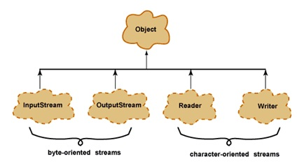

# JavaIO

## Что такоe символьная ссылка

Символьная ссылка (Symbolic link, симлинк) - специальный файл в файловой системе, содержащий только текстовую строку с указателем. Эта строка трактуется как путь к файлу, который должен быть открыт при попытке обратиться к данному файлу.

## Какая разница между **I/О** и **NIO**

**I/O** (Input/Output, ввод-вывод ) - взаимодействие между обработчиком информации и её поставщиком и/или получателем. Ввод - сигнал или данные, полученные обработчиком, а вывод - сигнал или данные, посланные им (или из него).

**NIO** (Non-blocking I/O, New I/O) - коллекция прикладных программных интерфейсов для языка Java, предназначенных для реализации высокопроизводительных операций ввода-вывода. Также встречается
аббревиатура **NIO.2** - она относится к нововведениям относительно этого направления в Java 7.

## Какие особенности NIO вы знаете

Ключевые особенности NIO:

- Каналы и селекторы: NIO поддерживает различные типы каналов. Канал является абстракцией объектов более низкого уровня файловой системы (например, отображенные в памяти файлы и блокировки файлов), что позволяет передавать данные с более высокой скоростью. Каналы не блокируются и поэтому Java предоставляет еще такие инструменты, как селектор, который позволяет выбрать готовый канал для передачи данных, и сокет, который является инструментом для блокировки.
- Буферы: в Java 7 была введена буферизация для всех классов-обёрток примитивов (кроме Boolean). Появился абстрактный класс Buffer, который предоставляет такие операции, как *clear*, *flip*, *mark* и т.д. Его подклассы предоставляют методы для получения и установки данных.
- Кодировки: в Java 7 появились кодировки (`java.nio.charset`), кодеры и декодеры для отображения байт и символов Unicode.

## Какие существуют виды потоков ввода/вывода

Потоки ввода/вывода используются для передачи данных в файловые потоки, на консоль или на сетевые соединения. Существует два вида потоков ввода/вывода: байтовые и символьные.



## Назовите основные классы потоков ввода/вывода

- Байтовые: `java.io.InputStream`, `java.io.OutputStream`;
- Символьные: `java.io.Reader`, `java.io.Writer`;

### Чем отличаются `OutputStream`, `InputStream`, `Writer` и `Reader`

Класс `OutputStream` - это абстрактный класс, определяющий потоковый байтовый вывод. В этой категории находятся классы, определяющие, куда направляются ваши данные: в массив байтов (но не напрямую в `String`, предполагается что вы сможете создать их из массива байтов), в файл или канал.
Базовый класс `InputStream` представляет классы, которые получают данные из различных источников:

- Массив байтов
- Строка (`String`)
- Файл
- Канал (pipe): данные помещаются с одного конца и извлекаются с другого
- Последовательность различных потоков, которые можно объединить в одном потоке
- Другие источники (например, подключение к интернету)

Символьные потоки имеют два основных абстрактных класса `Reader` и `Writer`, управляющие потоками символов Unicode. Класс Reader - абстрактный класс, определяющий символьный потоковый ввод. Класс `Writer` - абстрактный класс, определяющий символьный потоковый вывод. В случае ошибок все методы класса передают исключение `IOException`.

### Какие подклассы базового класса `InputStream` вы знаєте, для чего они предназначены

Подклассы базового класса `InputStream`:

- `StringBufferInputStream` - превращает строку (String) во входной поток данных InputStream.
- `SequenceInputStream` - сливает два или более потока InputStream в единый поток.
- `PushbackInputStream` - входной поток, поддерживающий однобайтовый возврат во входной поток.
- `PipedInputStream` - реализует понятие входного канала.
- `ObjectInputStream` - входной поток для объектов.
- `InputStream` - абстрактный класс, описывающий поток ввода.
- `FilterInputStream` - абстрактный класс, предоставляющий интерфейс для классов-надстроек, которые добавляют к существующим потокам полезные свойства.
- `FileInputStream` - для чтения информации из файла.
- `DataInputStream` - входной поток, включающий методы для чтения стандартных типов данных Java.
- `ByteArrayInputStream` - позволяет использовать буфер в памяти (массив байтов) в качестве источника данных для входного потока.
- `BufferedInputStream` - буферизированный входной поток.

### Какие подклассы базового класса `OutputStream` вы знаете, для чего они предназначены

Класс `OutputStream` - это абстрактный класс, определяющий потоковый байтовый вывод.
В этой категории находятся классы, определяющие, куда направляются ваши данные: в массив байтов (но не напрямую в `String`; предполагается что вы сможете создать их из массива байтов), в файл или канал.
Подклассы базового класса `OutputStream`:

- `PipedOutputStream` - реализует понятие выходного канала.
- `ObjectOutputStream` - выходной поток для объектов
- `FilterOutputStream` - абстрактный класс, предоставляющий интерфейс для классов-надстроек, которые добавляют к существующим потокам полезные свойства.
- `FileOutputStream` - отправка данных в файл на диске. Реализация класса `OutputStream`.
- `DataOutputStream` - выходной поток, включающий методы для записи стандартных типов данных Java.
- `ByteArrayOutputStream` - создает буфер в памяти. Все данные, посылаемые в этот поток, размещаются в созданном буфере.
- `BufferedOutputStream` - буферизированный выходной поток.
- `PrintStream` - выходной поток, включающий методы `print()` и `println()`.

## Для чего используется `PushbackInputStream`

Разновидность буферизации, обеспечивающая чтение байта с последующим его возвратом в поток. Класс `PushbackInputStream` представляет механизм "заглянуть" во входной поток и увидеть, что оттуда поступит в следующий раз, не извлекая информации.
У класса есть дополнительный метод `unread()`.

## Для чего используется `SequenceInputStream`

Класс `SequenceInputStream` позволяет соединять вместе несколько экземпляров класса InputStream. Конструктор принимает в качестве аргумента либо пару объектов класса InputStream, либо интерфейс `Enumeration`.
Во время работы класс выполняет запросы на чтение из первого объекта класса `InputStream` и до конца, а затем переключается на второй. При использовании интерфейса работа продолжится по всем объектам класса `InputStream`. По достижении конца каждого файла, связанный с ним поток закрывается. Закрытие потока, созданного объектом класса `SequenceInputStream`, приводит к закрытию всех открытых потоков.

## Какие подклассы базового класса `Reader` вы знаете, для чего они предназначены

Подклассы базового класса Reader:

- `StringReader` - входной поток, читающий из строки.
- `Reader` - абстрактный класс, описывающий символьный ввод.
- `PushbackReader` - входной поток, позволяющий возвращать символы обратно в поток.
- `PipedReader` - входной канал.
- `LineNumberReader` - входной поток, подсчитывающий строки.
- `InputStreamReader` - входной поток, транслирующий байты в символы.
- `FilterReader` - фильтрующий читатель.
- `FileReader` - входной поток, читающий файл.
- `CharArrayReader` - входной поток, который читает из символьного массива.
- `BufferedReader` - буферизированный входной символьный поток.

## Что вы знаете о `RandomAccessFile`

`RandomAccessFile` это класс который наследуется напрямую от `Object` и не наследуется от вышеприведенных базовых классов ввода\вывода. Предназначен для работы с файлами, поддерживая произвольный доступ к их содержимому.
Работа с классом `RandomAccessFile` напоминает использование совмещенных в одном классе потоков `DataInputStream` и `DataOutputStream` (они реализуют те же интерфейсы `DataInput` и `DataOutput`). Кроме того, метод `seek()` позволяет переместиться к определенной позиции и изменить хранящееся там значение.
При использовании `RandomAccessFile` необходимо знать структуру файла. Класс `RandomAccessFile` содержит методы для чтения и записи примитивов и строк UTF-8.

### Какие есть режимы доступа к файлу есть у `RandomAccessFile`

`RandomAccessFile` может открываться в режиме чтения ("r") или чтения/записи ("rw"). Также есть режим "rws", когда файл открывается для операций чтения-записи и каждое изменение данных файла немедленно записывается на физическое устройство.

## Какие подклассы базового класса `Writer` вы знаете, для чего они предназначены

Подклассы базового класса Writer:

- `Writer` - абстрактный класс, описывающий символьный вывод
- `StringWriter` - выходной поток, пишущий в строку
- `PrintWriter` - выходной поток, включающий методы `print()` и `println()`
- `PipedWriter` - выходной канал
- `OutputStreamWriter` - выходной поток, транслирующий байты в символы
- `FilterWriter` - фильтрующий писатель
- `FileWriter` - выходной поток, пишущий в файл
- `CharArrayWriter` - выходной поток, который пишет в символьный массив
- `BufferedWriter` - буферизированный выходной символьный поток

## Что такое абсолютный путь и относительный путь

Абсолютный путь - это путь, который указывает на одно и то же место в файловой системе, вне зависимости от текущей директории. Полный путь всегда начинается с корневого каталога.
Относительный путь - это путь по отношению к текущему рабочему каталогу.

## В каких пакетах лежат классы-потоки

Стандартный классы ввода\вывода в Java лежат в пакете `java.io.*`. В JDK 7 добавлен более современный способ работы с потоками под названием **Java NIO** или **Java New IO** эти классы лежат в пакете `java.nio.*`. Для работы с архивами используются классы из пакета `java.util.*`.

## Что вы знаете о классах-надстройках

Классы-настройки ето классы которые добавляют к существующим потокам полезные дополнительные свойства.

Примеры классов:

- `BufferedOutputStream`
- `BufferedInputStrem`
- `BufferedWriter`
- `BufferedReader`

Эти классы буферезируют поток и повышают производительность.

### Какой класс-надстройка позволяет читать данные из входного байтового потока в формате примитивных типов данных

Для чтения байтовых данных (не строк) применяется класс `DataInputStream`. В этом случае необходимо использовать классы из группы `InputStream`.
Для преобразования строки в массив байтов, пригодный для помещения в поток `ByteArrayInputStream`, в классе String предусмотрен метод `getBytes()`. Полученный `ByteArrayInputStream` представляет собой поток `InputStream`, подходящий для передачи `DataInputStream`.
При побайтовом чтении символов из форматированного потока `DataInputStream` методом `readByte()` любое полученное значение будет считаться действительным, поэтому возвращаемое значение неприменимо для идентификации конца потока. Вместо этого можно использовать метод `available()`, который сообщает, сколько еще осталось символов.
Класс `DataInputStream` позволяет читать элементарные данные из потока через интерфейс `DataInput`, который определяет методы, преобразующие элементарные значения в форму последовательности байтов. Такие потоки облегчают сохранение в файле двоичных данных.

### Какие классы-надстройки позволяют ускорить чтение/запись за счет использования буфера

Для этого используются классы, позволяющие буферизировать поток:

- `java.io.BufferedInputStream` - буферизированный входной поток. Конструкторы: `BufferedInputStream(InputStream in)`, `BufferedInputStream(InputStream in, int size)`.
- `java.io.BufferedOutputStream` - буферизированный выходной поток. Конструкторы: `BufferedOutputStream(OutputStream out)`, `BufferedOutputStream(OutputStream out, int size)`.
- `java.io.BufferedReader` - буферизированный входной символьный поток. Конструкторы: `BufferedReader(Reader r)`, `BufferedReader(Reader in, int sz)`.
- `java.io.BufferedWriter` - буферизированный выходной символьный поток. Конструкторы: `BufferedWriter(Writer out)`, `BufferedWriter(Writer out, int sz)`.

## Какие классы позволяют преобразовать байтовые потоки в символьные и обратно

`OutputStreamWriter` - это мост между классом `OutputStream` и классом `Writer`. Символы, записанные в поток, преобразовываются в байты.

```Java
OutputStream os = new FileOutputStream(./data/out.txt);
Writer osw = new OutputStreamWriter(os, "UTF-8");

osw.write("Hello World!");
osw.close();
```

`InputStreamReader` - аналог для чтения. При помощи методов класса `Reader` читаются байты из потока `InputStream` и далее преобразуются в символы.

```Java
OutputStream is = new FileInputStream(./data/in.txt);
Reader reader = new InputStreamWriter(is, "UTF-8");

int data = reader.read();
while(data != -1) {
    char theChar = (char) data;
    data = reader.read();
}
reader.close();
```

## В чем отличие класса `PrintWriter` от `PrintStream`

Прежде всего, в классе `PrintWriter` применен усовершенствованный способ работы с символами UNICODE и другой механизм буферизации вывода.

В классе `PrintStream` буфер вывода сбрасывался всякий раз, когда вызывался метод `print()` или `println()`. При использовании класса PrintWriter вы можете отказаться от автоматического сброса буферов, выполняя его явным образом при помощи метода `flush()`.
В классе `PrintWriter` предусмотрено два конструктора, позволяющих работать с выходными потоками класса `OutputStream`:

- `public PrintWriter(OutputStream out);` - создает поток без автоматического сброса буферов.
- `public PrintWriter(OutputStream out, boolean autoFlush);` - способ сброса буферов при использовании второго конструктора зависит от значения параметра **autoFlush**. Если он равен `true`, автоматический сброс буферов выполняется, а если `false` - нет.

Набор реализаций основных методов `print()` и `println()` класса `PrintWriter` аналогичен набору реализация этих методов класса `PrintStream`.
Здесь же мы упомянем только методы `flush()` и `checkError()`.
Метод `flush()` вызывает принудительный сброс буфера вывода. Если поток `PrintWriter` создан на базе стандартного потока вывода `System.out`, то записанные в него данные появятся на консоли только после выполнения сброса буфера (автоматического или сделанного методом `flush()`).
Что же касается метода `checkError()`, то в случае возникновения ошибок он возвращает значение `true`.

## Какой класс предназначен для работы с элементами файловой системы

В отличие от большинства классов ввода/вывода, класс `File` работает не с потоками, а непосредственно с файлами. Данный класс позволяет получить информацию о файле: права доступа, время и дата создания, путь к каталогу. А также осуществлять навигацию по иерархиям подкаталогов.
Класс `java.io.File` может представлять имя определённого файла, а также имена группы файлов, находящихся в каталоге. Если класс представляет каталог, то его метод `list()` возвращает массив строк с именами всех файлов.
Для создания объектов класса `File` можно использовать один из следующих конструкторов.

- `File(File dir, String name)` - указывается объекта класса `File` (каталог) и имя файла
- `File(String path)` - указывается путь к файлу без указания имени файла
- `File(String dirPath, Sring name)` - указывается путь к файлу и имя файла
- `File(URI url)` - указывается объекта URI, описывающий файл

### Какой символ является разделителем при указании пути в файловой системе

Для различных систем символ разделителя различается. Вытащить его можно используя file.separator, а так же в статическом поле `File.separator`.  Для Windows это "\".

### Какие методы класса `File` вы знаете

У класса `File` очень много методов, перечислим некоторые.

- `getAbsolutePath()` - абсолютный путь файла, начиная с корня системы. В Android корневым элементом является символ слеша (/)
- `canRead()` - доступно для чтения
- `canWrite()` - доступно для записи
- `exists()` - файл существует или нет
- `getName()` - возвращает имя файла
- `getParent()` - возвращает имя родительского каталога
- `getPath()` - путь
- `lastModified()` - дата последнего изменения
- `isFile()` - объект является файлом, а не каталогом
- `isDirectory` - объект является каталогом
- `isAbsolute()` - возвращает true, если файл имеет абсолютный путь
- `renameTo(File newPath)` - переименовывает файл. В параметре указывается имя нового имени файла. Если переименование прошло неудачно, то возвращается `false`
- `delete()` - удаляет файл. Также можно удалить пустой каталог

### Что вы знаете об интерфейсе `FileFilter`

Интерфейс `FileFilter` применяется для проверки, попадает ли объект ли объект `File` под некоторое условие. Этот интерфейс содержит единственный метод `boolean accept(File pathName)`. Этот метод необходимо переопределить и реализовать.

## Какие классы позволяют архивировать объекты

- `DeflaterOutputStream`
- `InflaterInputStream`
- `ZipInputStream`
- `ZipOutputStream`
- `GZIPInputStream`
- `GZIPOutputStream`
