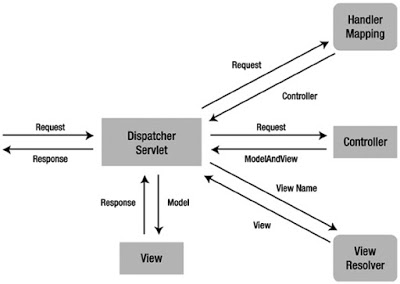

# Spring Framework

## Что такое Spring? Из каких частей состоит Spring Framework

**Spring** - фреймворк с открытым исходным кодом, предназначеный для упрощения разработки enterprise-приложений. Одним из главным преимуществом **Spring** является его слоистая архитектура, позволяющая вам самим определять какие компоненты будут использованы в вашем приложении. Модули **Spring** построены на базе основного контейнера, который определяет создание, конфигурация и менеджмент бинов.
Основные модули:

- **Spring Core** - предоставляет основной функционал Spring. Главным компонентом контейнера является BeanFactory - реализация паттерна Фабрика. BeanFactory позволяет разделить конфигурацию приложения и информацию о зависимостях от кода.
- **Spring context** - конфигурационный файл, который предоставляет информация об окружающей среде для Spring. Сюда входят такие enterprise-сервисы, как JNDI, EJB, интернационализация, валиадция и т.п.
- **Spring AOP** - отвечает за интеграцию аспектно-ориентированного программирования во фреймворк. Spring AOP обеспечивает сервис управления транзакциями для Spring-приложения.
- **Spring DAO** - абстрактный уровень Spring JDBC DAO предоставляет иерархию исключений и множество сообщений об ошибках для разных БД. Эта иерархия упрощает обработку исключений и значительно уменьшает количество кода, которое вам нужно было бы написать для таких операций, как, например, открытие и закрытие соединения.
- **Spring ORM** - отвечает за интеграцию Spring и таких популярных ORM-фреймворков, как Hibernate, iBatis и JDO.
- **Spring Web module** - классы, которые помогают упростить разработку Web (авторизация, доступ к бинам Spring-а из web).
- **Spring MVC framework** - реализация паттерна MVC для построения Web-приложений.

## Каковы некоторые из важных особенностей и преимуществ Spring Framework

Spring Framework обеспечивает решения многих задач, с которыми сталкиваются Java-разработчики и организации, которые хотят создать информационную систему, основанную на платформе Java. Из-за широкой функциональности трудно определить наиболее значимые структурные элементы, из которых он состоит. Spring Framework не всецело связан с платформой Java Enterprise, несмотря на его масштабную интеграцию с ней, что является важной причиной его популярности.

- Относительная легкость в изучении и применении фреймворка в разработке и поддержке приложения.
- Внедрение зависимостей (DI) и инверсия управления (IoC) позволяют писать независимые друг от друга компоненты, что дает преимущества в командной разработке, переносимости модулей и т.д..
- Spring IoC контейнер управляет жизненным циклом Spring Bean и настраивается наподобие JNDI  lookup (поиска).
- Проект Spring содержит в себе множество подпроектов, которые затрагивают важные части создания софта, такие как вебсервисы, веб программирование, работа с базами данных, загрузка файлов, обработка ошибок и многое другое. Всё это настраивается в едином формате и упрощает поддержку приложения.

### Каковы преимущества использования Spring Tool Suite

Для упрощения процесса разработки основанных на Spring приложений в Eclipse (наиболее часто используемая IDE-среда для разработки Java-приложений), в рамках Spring создан проект Spring IDE. Проект бесплатный. Он интегрирован в Eclipse IDE, Spring IDE, Mylyn (среда разработки в Eclipse, основанная на задачах), Maven for Eclipse, AspectJ Development Tool.

## Что такое **AOP**? Как это относится к **IoC**

Аспектно-ориентированное программирование (АОП) - парадигма программирования, основанная на идее разделения функциональности для улучшения разбиения программы на модули. AOP и Spring - взаимодополняющие технологии, которые позволяют решать сложные проблемы путем разделения функционала на отдельные модули. АОП предоставляет возможность реализации сквозной логики - т.е. логики, которая применяется к множеству частей приложения - в одном месте и обеспечения автоматического применения этой логики по всему приложению. Подход Spring к АОП заключается в создании "динамических прокси" для целевых объектов и "привязывании" объектов к конфигурированному совету для выполнения сквозной логики.

### Что такое Aspect, Advice, Pointcut, JointPoint и Advice Arguments в АОП

Основные понятия АОП:

- Аспект (англ. aspect) - модуль или класс, реализующий сквозную функциональность. Аспект изменяет поведение остального кода, применяя совет в точках соединения, определённых некоторым срезом.
- Совет (англ. advice) - фрагмент кода, который должен выполняться в отдельной точке соединения. Существует несколько типов советов, совет может быть выполнен до, после или вместо точки соединения.
- Точка соединения (англ. joinpoint) - это четко определенная точка в выполняемой программе, где следует применить совет. Типовые примеры точек соединения включают обращение к методу, собственно Method Invocation, инициализацию класса и создание экземпляра объекта. Многие реализации АОП позволяют использовать вызовы методов и обращения к полям объекта в качестве точек соединения.
- Срез (англ. pointcut) - набор точек соединения. Срез определяет, подходит ли данная точка соединения к данному совету. Самые удобные реализации АОП используют для определения срезов синтаксис основного языка (например, в AspectJ применяются Java-сигнатуры) и позволяют их повторное использование с помощью переименования и комбинирования.
- Связывание(англ. weaving) представляет собой процесс действительной вставки аспектов в определенную точку кода приложения. Для решений АОП времени компиляции это делается на этапе компиляции, обычно в виде дополнительного шага процесса сборки. Аналогично, для решений АОП времени выполнения связывание происходит динамически во время выполнения. В AspectJ поддерживается еще один механизм связывания под названием связывание во время загрузки (load-time weaving - LTW), который перехватывает лежащий в основе загрузчик классов JVM и обеспечивает связывание с байт-кодом, когда он загружается загрузчиком классов.
- Цель(англ. target) - это объект, поток выполнения которого изменяется каким-то процессом АОП. На целевой объект часто ссылаются как на объект, снабженный советом.
- Внедрение (англ. introduction, введение) - представляет собой процесс, посредством которого можно изменить структуру объекта за счет введения в него дополнительных методов или полей, изменение иерархии наследования для добавления функциональности аспекта в инородный код. Обычно реализуется с помощью некоторого метаобъектного протокола (англ. metaobject protocol, MOP).

### В чем разница между Spring AOP и AspectJ АОП

AspectJ де-факто является стандартом реализации АОП. Реализация АОП от Spring имеет некоторые отличия:

- Spring AOP немного проще, т.к. нет необходимости следить за процессом связывания.
- Spring AOP поддерживает аннотации AspectJ, таким образом мы можем работать в спринг проекте похожим образом с AspectJ проектом.
- Spring AOP поддерживает только proxy-based АОП и может использовать только один тип точек соединения - Method Invocation. AspectJ поддерживает все виды точек соединения.

Недостатком Spring AOP является работа только со своими бинами, которые существуют в Spring Context.

## Что такое IoC контейнер Spring

По своей сути IoC, а, следовательно, и DI, направлены на то, чтобы предложить простой механизм для предоставления зависимостей компонента (часто называемых коллабораторами объекта) и управления этими зависимостями на протяжении всего их жизненного цикла. Компонент, который требует определенных зависимостей, зачастую называют зависимым объектом или, в случае IoC, целевым объектом. IoC предоставляет службы, через которые компоненты могут получать доступ к своим зависимостям, и службы для взаимодействия с зависимостями в течение их времени жизни. В общем случае IoC может быть расщеплена на два подтипа: инверсия управления (Dependency Injection) и инверсия поиска (Dependency Lookup). Инверсия управления — это крупная часть того, делает Spring, и ядро реализации Spring основано на инверсии управления, хотя также предоставляются и средства Dependency Lookup. Когда платформа Spring предоставляет коллабораторы зависимому объекту автоматически, она делает это с использованием инверсии управления (Dependency Injection). В приложении, основанном на Spring, всегда предпочтительнее применять Dependency Injection для передачи коллабораторов зависимым объектам вместо того, чтобы заставлять зависимые объекты получать коллабораторы через поиск.

## Что такое Spring bean

Термин бин (англ. Bean) - в Spring используется для ссылки на любой компонент, управляемый контейнером. Обычно бины на определенном уровне придерживаются спецификации JavaBean, но это не обязательно особенно если для связывания бинов друг с другом планируется применять Constructor Injection. Для получения экземпляра бина используется ApplicationContext. IoC контейнер управляет жизненным циклом спринг бина, областью видимости и внедрением.

### Какое значение имеет конфигурационный файл Spring Bean

Конфигурационный файл спринг определяет все бины, которые будут инициализированы в Spring Context. При создании экземпляра Spring ApplicationContext будет прочитан конфигурационный xml файл и выполнены указанные в нем необходимые инициализации. Отдельно от базовой конфигурации, в файле могут содержаться описание перехватчиков (interceptors), view resolvers, настройки локализации и др...

### Каковы различные способы настроить класс как Spring Bean

Существует несколько способов работы с классами в Spring:
XML конфигурация:

```XML
<bean name="name" class="com.swchck.spring.beans.BeanName"/>
```

Java based конфигурация. Все настройки и указания бинов прописываются в java коде:

```Java
@Configuration
@ComponentScan(value = "com.swchck.sping.main")
public class Configuration {
    @Bean
    public Service getService() {
        return new Service();
    }
}
```

Для извлечения бина из контекста используется следующий подход:

```Java
AnnotationConfigApplicationContext context = new AnnotationConfigApplicationContext(Configuration.class);
Service service = context.getBean(Service.class);
```

Annotation based конфигурация. Можно использовать внутри кода аннотации @Component, @Service, @Repository, @Controller для указания классов в качестве спринг бинов. Для их поиска и управления контейнером прописывается настройка в xml файле:

```XML
<context:component-scan base-package="com.swchck.spring">
```

### Какие вы знаете различные scope у Spring Bean

В Spring предусмотрены различные области времени действия бинов:
singleton - может быть создан только один экземпляр бина. Этот тип используется спрингом по умолчанию, если не указано другое. Следует осторожно использовать публичные свойства класса, т.к. они не будут потокобезопасными.
prototype - создается новый экземпляр при каждом запросе.
request -  аналогичен prototype, но название служит пояснением к использованию бина в веб приложении. Создается новый экземпляр при каждом HTTP request.
session - новый бин создается в контейнере при каждой новой HTTP сессии.
global-session: используется для создания глобальных бинов на уровне сессии для Portlet  приложений.

### Что такое жизненный цикл Spring Bean

Жизненный цикл Spring бина - время существования класса. Spring бины инициализируются при инициализации Spring контейнера и происходит внедрение всех зависимостей. Когда контейнер уничтожается, то уничтожается и всё содержимое. Если нам необходимо задать какое-либо действие при инициализации и уничтожении бина, то нужно воспользоваться методами `init()` и `destroy()`. Для этого можно использовать аннотации `@PostConstruct` и `@PreDestroy`.

```Java
@PostConstruct
public void init() {
    System.out.println("Bean init")
}

@PreDestroy
public void destroy() {
    System.out.println("Bean destroyed")
}
```

Или через xml конфигурацию:

```XML
<bean name="Bean" class="com.swchck.spring.beans.Bean" init-method="init" destroy-method="destroy">
    <property name="propertyName" ref="propertyName"/>
</bean>
```

### Объясните работу BeanFactory в Spring

BeanFactory - это реализация паттерна Фабрика, его функицональность покрывает создание бинов. Так как эта фабрика знает многие об объектах приложения, то она может создавать связи между объектами на этапе создания экземпляра. Существует несколько реализаций BeanFactory, самая используемся -  "org.springframework.beans.factory.xml.XmlBeanFactory". Она загружает бины на основе конфигурационного XML-файла. Чтобы создать XmlBeanFactory передайте конструктору InputStream, например:

```Java
BeanFactory factory = new XmlBeanFactory(new FileInputStream("Bean.xml"));
```

После этой строки фабрика знает о бинах, но их экземпляры еще не созданы. Чтобы инстанцировать бин нужно вызвать метод getBean(). Например:

```Java
Bean bean_one = (Bean) factory.getBean("Bean")
```

### Как получить объекты ServletContext и ServletConfig внутри Spring Bean

Доступны два способа для получения основных объектов контейнера внутри бина:
Реализовать один из Spring*Aware (ApplicationContextAware, ServletContextAware, ServletConfigAware и др.) интерфейсов.
Использовать автоматическое связывание @Autowired в спринг. Способ работает внутри контейнера спринг.

```Java
@Autowired
ServletContext servletContext;
```

## В чем роль ApplicationContext в Spring

В то время, как BeanFactory используется в простых приложениях, Application Context - это более сложный контейнер. Как и BeanFactory он может быть использован для загрузки и связывания бинов, но еще он предоставляет:

- возможность получения текстовых сообщений, в том числе поддержку интернационализации
- общий механизм работы с ресурсами;
- события для бинов, которые зарегестрированы как слушатели.

Из-за большей функциональности рекомендуется использование Application Context вместо BeanFactory. Последний используется только в случаях нехватки ресурсов, например при разработке для мобильных устройств

## Как выглядит типичная реализция метода используя Spring

Для типичного Spring-приложения нам необходимы следующие файлы:
Интерфейс, описывающий функционал приложения
Реализация интерфейса, содержащая свойства, сэттеры-гэттеры, функции и т.п.
Конфигурационный XML-файл Spring'а.
Клиентское приложение, которое использует функцию.

## Что такое связывание в Spring и расскажите об аннотации `@Autowired`

Процесс внедрения зависимостей в бины при инициализации называется Spring Bean Wiring. Считается хорошей практикой задавать явные связи между зависимостями, но в Spring предусмотрен дополнительный механизм связывания @Autowired. Аннотация может использоваться над полем или методом для связывания по типу. Чтобы аннотация заработала, необходимо указать небольшие настройки в конфигурационном файле спринг с помощью элемента context:annotation-config.

### Каковы различные типы автоматического связывания в Spring

Существует четыре вида связывания в спринг:

- autowire byName,
- autowire byType,
- autowire by constructor,
- autowiring by @Autowired and @Qualifier annotations

## Приведите пример часто используемых аннотаций Spring

- `@Controller` - класс фронт контроллера в проекте Spring MVC.
- `@RequestMapping` - позволяет задать шаблон маппинга URI в методе обработчике контроллера.
- `@ResponseBody` - позволяет отправлять Object в ответе. Обычно используется для отправки данных формата XML или JSON.
- `@PathVariable` - задает динамический маппинг значений из URI внутри аргументов метода обработчика.
- `@Autowired` - используется для автоматического связывания зависимостей в spring beans.
- `@Qualifier` - используется совместно с @Autowired для уточнения данных связывания, когда возможны коллизии (например одинаковых имен\типов).
- `@Service` - указывает что класс осуществляет сервисные функции.
- `@Scope` - указывает scope у spring bean.
- `@Configuration`, `@ComponentScan` и `@Bean` - для java based configurations.
- AspectJ аннотации для настройки aspects и advices, `@Aspect`, `@Before`, `@After`,`@Around`, `@Pointcut` и др.

## Можем ли мы послать объект как ответ метода обработчика контроллера

Да, это возможно. Для этого используется аннотация @ResponseBody. Так можно отправлять ответы в виде JSON, XML в restful веб сервисах.

## Является ли Spring bean потокобезопасным

По умолчанию бин задается как синглтон в Spring. Таким образом все публичные  переменные класса могут быть изменены одновременно из разных мест. Так что - нет, не является. Однако поменяв область действия бина на request, prototype, session он станет потокобезопасным, но это скажется на производительности.

## Как создать ApplicationContext в программе Java

В независимой Java программе ApplicationContext можно создать следующим образом:
AnnotationConfigApplicationContext - при использовании Spring в качестве автономного приложения можно создать инициализировать контейнер с помощью аннотаций. Пример:

```Java
ApplicationContext context = new AnnotationConfigApplicationContext("bean.xml");
```

ClassPathXmlApplicationContext - получает информацию из xml-файла, находящегося в classpath. Пример:

```Java
ApplicationContext context = new ClassPathXmlApplicationContext("bean.xml");
```

FileSystemXmlApplicationContext - получает информацию из xml-файла, но с возможностью загрузки файла конфигурации из любого места файловой системы. Пример:

```Java
ApplicationContext context = new FileSystemXmlApplicationContext("bean.xml");
```

XmlWebApplicationContext - получает информацию из xml-файла за пределами web-приложения.

## Можем ли мы иметь несколько файлов конфигурации Spring

С помощью указания contextConfigLocation можно задать несколько файлов конфигурации Spring. Параметры указываются через запятую или пробел:

```XML
<servlet>
    <servlet-name>app</servlet-name>
    <servlet-class>org.springframework.web.servlet.DispatcherServlet</servlet-class>
    <init-param>
        <param-name>contextConfigLocation</paramName>
        <param-value>/../../servlet-context-1.xml, /../../servlet-context-2.xml</param-value>
    </init-param>
    <load-on-startup>1</load-on-startup>
</servlet>
```

Поддерживается возможность указания нескольких корневых файлов конфигурации Spring:

```XML
<context-param>
    <param-name>contextConfigLocation</param-name>
    <param-value>../root-context.xml ../root-security.xml</param-value>
</context-param>
```

Файл конфигурации можно импортировать:

```XML
<bean:import resource="root-security.xml"/>
```

## Как внедрить java.util.Properties в Spring Bean

Для возможности использования Spring EL для внедрения свойств (properties) в различные бины необходимо определить propertyConfigure bean, который будет загружать файл свойств.

```XML
<bean id="propertyConfigurer" class="org.springframework.context.support.PropertySourcesPlaceholderConfigurer">
    <property name="location" value="../application.properties"/>
</bean>

<bean class="com.swchck.spring.dao.impl.TestDaoImpl">
    <property name="maxReadResults" value="${results.read.max}"/>
</bean>
```

Или через аннотации:

```Java
@Value("${maxReadResults}")
private int maxReadResults;
```

## Как настраивается соединение с БД в Spring

Используя datasource `org.springframework.jdbc.datasource.DriverManagerDataSource`. Пример:

```XML
<bean id="dataSource" class="org.springframework.jdbc.datasource.DriverManagerDataSource">
    <property name="driverClassName">
        <value>org.hsqldb.jdbcDriver</value>
    </property>
    <property name="url">
        <value>jdbc:hsqldb:db/appfuse</value>
    </property>
    <property name="username">
        <value>user</value>
    </property>
    <property name="password">
        <value>password</value>
    </property>
</bean>
```

## Как сконфигурировать JNDI не через datasource в applicationContext.xml

Используя `org.springframework.jndi.JndiObjectFactoryBean`. Пример

```XML
<bean id="dataSource" class="org.springframework.jndi.JndiObjectFactoryBean">
    <property name="jndiName">
        <value>java:../jdbc/</value>
    </property>
</bean>
```

## Каким образом можно управлять транзакциями в Spring

Транзакциями в Spring управляют с помощью Declarative Transaction Management (программное управление). Используется аннотация @Transactional для описания необходимости управления транзакцией. В файле конфигурации нужно добавить настройку transactionManager для DataSource.

```XML
<bean id="transactionsManager" class="org.springframework.jdbc.datasource.DataSourceTransactionsManager">
    <property name="dataSource" ref="dataSource"/>
</bean>
```

## Каким образом Spring поддерживает DAO

Spring DAO предоставляет возможность работы с доступом к данным с помощью технологий вроде JDBC, Hibernate в удобном виде. Существуют специальные классы: JdbcDaoSupport, HibernateDaoSupport, JdoDaoSupport, JpaDaoSupport.
Класс HibernateDaoSupport является подходящим суперклассом для Hibernate DAO. Он содержит методы для получения сессии или фабрики сессий. Самый популярный метод - getHibernateTemplate(), который возвращает HibernateTemplate. Этот темплейт оборачивает checked-исключения Hibernate в runtime-исключения, позволяя вашим DAO оставаться независимыми от исключений Hibernate.
Пример:

```Java
public class UserDAOHibernate extends HibernateDaoSupport {
    public User getUser(Long id) {
        return (User) getHibernateTemplate().get(User.class, id);
    }
    public void saveUser(User user) {
        getHibernateTemplate().saveOrUpdate(user);
        if (log.isDebugEnabled()) {
            log.debug("userId set to: " + user.getId())
        }
    }
    public void removeUser(Long id) {
        Object user = getHibernateTemplate().load(User.class, id);
        getHibernateTemplate().delete(user);
    }
}
```

## Как интегрировать Spring и Hibernate

Для интеграции Hibernate в Spring необходимо подключить зависимости, а так же настроить файл конфигурации Spring. Т.к. настройки несколько отличаются между проектами и версиями, то смотрите официальную документацию Spring и Hibernate для уточнения настроек для конкретных технологий.

### Как задаются файлы маппинга Hibernate в Spring

Через applicationContext.xml в web/WEB-INF. Например:

```XML
<property name="mappingResources">
    <list>
        <value>com/swchck/model/User.hbm.xml</value>
    </list>
</property>
```

## Как добавить поддержку Spring в web-приложение

Достаточно просто указать ContextLoaderListener в web.xml файле приложения:

```XML
<litener>
    <listener-class>org.springframework.web.context.ContextLoaderListener</listener-class>
</listener>
```

## Можно ли использовать xyz.xml вместо applicationContext.xml

ContextLoaderListener - это ServletContextListener, который инициализируется когда ваше web-приложение стартует. По-умолчанию оно загружает файл WEB-INF/applicationContext.xml. Вы можете изменить значение по-умолчанию, указав параметр contextConfigLocation. Пример:

```XML
<listener>
    <listener-class>org.springframework.web.context.ContextLoaderListener</listener-class>
        <context-param>
            <param-name>contextConfigLocation</param-name>
            <param-value>/WEB-INF/notapplicationcontext.xml</param-value>
        </context-param>
    </listener-class>
</listener>
```

## Что такое контроллер в Spring MVC

Ключевым интерфейсом в Spring MVC является Controller. Контроллер обрабатывает запросы к действиям, осуществляемые пользователями в пользовательском интерфейсе, взаимодействуя с уровнем обслуживания, обновляя модель и направляя пользователей на соответствующие представления в зависимости от результатов выполнения. Controller - управление, связь между моделью и видом.



Основным контроллером в Spring MVC является org.springframework.web.servlet.DispatcherServlet. Задается аннотацией @Controller и часто используется с аннотацией @RequestMapping, которая указывает какие запросы будут обрабатываться этим контроллером.

## Какая разница между аннотациями @Component, @Repository и @Service в Spring

- `@Component` - используется для указания класса в качестве компонента spring. При использовании поиска аннотаций, такой класс будет сконфигурирован как spring bean.
- `@Controller` - специальный тип класса, применяемый в MVC приложениях. Обрабатывает запросы и часто используется с аннотацией @RequestMapping.
- `@Repository` - указывает, что класс используется для работы с поиском, получением и хранением данных. Аннотация может использоваться для реализации шаблона DAO.
- `@Service` - указывает, что класс является сервисом для реализации бизнес логики (на самом деле не отличается от Component, но просто помогает разработчику указать смысловую нагрузку класса).
Для указания контейнеру на класс-бин можно использовать любую из этих аннотаций. Но различные имена позволяют различать назначение того или иного класса.

## Расскажите, что вы знаете о DispatcherServlet и ContextLoaderListener

DispatcherServlet - сервлет диспатчер. Этот сервлет анализирует запросы и направляет их соответствующему контроллеру для обработки. В Spring MVC класс DispatcherServlet является центральным сервлетом, который получает запросы и направляет их соответствующим контроллерам. В приложении Spring MVC может существовать произвольное количество экземпляров DispatcherServlet, предназначенных для разных целей (например, для обработки запросов пользовательского интерфейса, запросов веб-служб REST и т.д.). Каждый экземпляр DispatcherServlet имеет собственную конфигурацию WebApplicationContext, которая определяет характеристики уровня сервлета, такие как контроллеры, поддерживающие сервлет, отображение обработчиков, распознавание представлений, интернационализация, оформление темами, проверка достоверности, преобразование типов и форматирование и т.п.
ContextLoaderListener - слушатель при старте и завершении корневого класса Spring WebApplicationContext. Основным назначением является связывание жизненного цикла ApplicationContext и ServletContext, а так же автоматического создания ApplicationContext. Можно использовать этот класс для доступа к бинам из различных контекстов спринг. Настраивается в web.xml:

```XML
<context-param>
    <param-name>contextConfigLocation</param-name>
    <param-value>/WEB-INF/spring/root-context.xml</param-value>
</context-param>

<listener>
    <listener-class>org.springframework.web.context.ContextLoaderListener</listener-class>
</listener>
```

## Что такое ViewResolver в Spring

ViewResolver - распознаватель представлений. Интерфейс ViewResolver в Spring MVC (из пакета org.springframework.web.servlet) поддерживает распознавание представлений на основе логического имени, возвращаемого контроллером. Для поддержки различных механизмов распознавания представлений предусмотрено множество классов реализации. Например, класс UrlBasedViewResolver поддерживает прямое преобразование логических имен в URL. Класс ContentNegotiatingViewResolver поддерживает динамическое распознавание представлений в зависимости от типа медиа, поддерживаемого клиентом (XML, PDF, JSON и т.д.). Существует также несколько реализаций для интеграции с различными технологиями представлений, такими как FreeMarker (FreeMarkerViewResolver), Velocity (VelocityViewResolver) и JasperReports (JasperReportsViewResolver).

```XML
<!-- Resolves views selected for rendering by @Controllers to .jsp resources
            in the /WEB-INF/views directory -->
<bean class="org.springframework.web.servlet.view.InternalResource.ViewController">
    <property name="prefix" value="/WEB-INF/views"/>
    <property name+"suffix" value=".jsp"/>
</bean>
```

InternalResourceViewResolver - реализация ViewResolver, которая позволяет находить представления, которые возвращает контроллер для последующего перехода к нему. Ищет по заданному пути, префиксу, суффиксу и имени.
Что такое MultipartResolver и когда его использовать?
Интерфейс MultipartResolver используется для загрузки файлов. Существуют две реализации: CommonsMultipartResolver и StandardServletMultipartResolver, которые позволяют фреймворку загружать файлы. По умолчанию этот интерфейс не включается в приложении и необходимо указывать его в файле конфигурации. После настройки любой запрос о загрузке будет отправляться этому интерфейсу.

```XML
<beans:bean id="multipartResolver" class="org.springframework.web.multipart.commons.CommonsMultipartResolver">
    <!-- setting maximum upload size -->
    <beans:property name="maxUploadSize" value="100000"/>
</beans:bean>
```

## Как загрузить файл в Spring MVC

Внутри спринг предусмотрен интерфейс MultipartResolver для обеспечения загрузки файлов. Фактически нужно настроить файл конфигурации для указания обработчика загрузки файлов, а затем задать необходимый метод в контроллере spring.

## Как обрабатывать исключения в Spring MVC Framework

В Spring MVC интерфейс HandlerExceptionResolver (из пакета org.springframework.web.servlet) предназначен для работы с непредвиденными исключениями, возникающими во время выполнения обработчиков. По умолчанию DispatcherServlet регистрирует класс DefaultHandlerExceptionResolver (из пакета org.springframework.web.servlet.mvc.support). Этот распознаватель обрабатывает определенные стандартные исключения Spring MVC, устанавливая специальный код состояния ответа. Можно также реализовать собственный обработчик исключений, аннотировав метод контроллера с помощью аннотации @ExceptionHandler и передав ей в качестве атрибута тип исключения. В общем случае обработку исключений можно описать таким образом:
Controller Based - указать методы для обработки исключения в классе контроллере. Для этого нужно пометить такие методы аннотацией @ExceptionHandler.
Global Exception Handler - для обработки глобальных исключений spring предоставляет аннотацию @ControllerAdvice.
HandlerExceptionResolver implementation – общие исключений большая часть времени обслуживают статические страницы. Spring Framework предоставляет интерфейс HandlerExceptionResolver, который позволяет задать глобального обработчика исключений. Реализацию этого интерфейса можно использовать для создания собственных глобальных обработчиков исключений в приложении.

## Каковы минимальные настройки, чтобы создать приложение Spring MVC

Для создания простого Spring MVC приложения необходимо пройти следующие шаги:

- Добавить зависимости spring-context и spring-webmvc в проект.
- Указать DispatcherServlet в web.xml для обработки запросов внутри приложения.
- Задать определение spring bean (аннотацией или в xml).
- Добавить определение view resolver для представлений.
- Настроить класс контроллер для обработки клиентских запросов.

## Как бы вы связали Spring MVC Framework и архитектуру MVC

Модель (Model) - выступает любой Java bean в Spring. Внутри класса могут быть заданы различные атрибуты и свойства для использования в представлении.
Преставление (View) - JSP страница, HTML файл и т.п. служат для отображения необходимой информации пользователю. Представление передает обработку запросов к диспетчеру сервлетов (контроллеру).
DispatcherServlet (Controller) - это главный контроллер в приложении Spring MVC, который обрабатывает все входящие запросы и передает их для обработки в различные методы в контроллеры.

## Как добиться локализации в приложениях Spring MVC

Spring MVC предоставляет очень простую и удобную возможность локализации приложения. Для этого необходимо сделать следующее:

- Создать файл resource bundle, в котором будут заданы различные варианты локализированной информации.
- Определить messageSource в конфигурации Spring используя классы ResourceBundleMessageSource или ResourceBundleMessageSource.
- Определить localceResolver класса CookieLocaleResolver для включения возможности переключения локали.
- С помощью элемента spring:message DispatcherServlet будет определять в каком месте необходимо подставлять локализированное сообщение в ответе.

```XML
<beans:bean id="messageSource" class="org.springframework.context.support.ReloadableResourceCundleMessageSource">
    <beans:property name="basename" value="classpath:messages"/>
    <beans:property name="defaultEncoding" value="UTF-8"/>
</bean>

<beans:bean id="localeResolver" class="org.springframework.web.servlet.i18n.CookieLocaleResolver">
    <beans:property name="defaultLocale" value="en"/>
    <beans:property name="cookieName" value="appLocaleCookie"/>
    <beans:property name="cookieMaxAge" value="3600"/>
</beans:bean>

<interceptors>
    <beans:bean class="org.springframework.web.servlet.i18n.LocaleChangeInterceptor">
        <beans:property name="paramName" value="locale"/>
    </beans:bean>
</interceptors>
```

## Как мы можем использовать Spring для создания веб-службы RESTful, возвращающей JSON

Spring Framework позволяет создавать Resful веб сервисы и возвращать данные в формате JSON. Spring обеспечивает интеграцию с Jackson JSON API для возможности отправки JSON ответов в resful web сервисе. Для отправки ответа в формате JSON из Spring MVC приложения необходимо произвести следующие настройки:
Добавить зависимости Jackson JSON. С помощью maven это делается так:

```XML
<!-- Jackson -->
<dependency>
    <groupid>com.fasterxml.jackson.core</groupid>
    <artifactid>jackson-databind</artifactid>
    <version>${jackson.databind.version}</version>
</dependency>
```

Настроить бин RequestMappingHandlerAdapter в файле конфигурации Spring и задать свойство messageConverters на использование бина MappingJackson2HttpMessageConverter.

```XML
<!-- Configure to plugin JSON as request and responce in method handler -->
<beans:bean class="org.springframework.web.servlet.mvc.method.annotation.RequestMappingHandlerAdapter">
    <beans:property name="messageConverters">
        <beans:list>
            <beans:ref bean="jsonMessageConverter"/>
        </beans:list>
    </beans:property>
</bean>

<!-- Configure bean to convert JSON to POJO and vice versa -->
<beans:bean id="jsonMessageConverter" class="org.springframework.http.converter.json.MappingJackson2HttpMessageConverter"/>
```

В контроллере указать с помощью аннотации @ResponseBody возвращение Object:

```Java
@RequestMapping(value = EmpRestURIConstants.GET_EMP, method = RequestMethod.GET)
public @ResponseBody Employee getEmployee(@PathVariable("id") int empId) {
    logger.info("getEmployee ID =" + empId);

    return empData.get(empId);
}
```

## Как проверить (валидировать) данные формы в Spring Web MVC Framework

Spring поддерживает аннотации валидации из JSR-303, а так же возможность создания своих реализаций классов валидаторов. Пример использования аннотаций:

```Java
@Size(min = 2, max = 30)
private String name;

@NotEmpty @Email
private String email;

@NotNull @Min(18) @Max(100)
private Integer age;

@NotNull
private Gender gender;

@DateTimeFormat(pattern = MM/dd/yyyy)
@NotNull @Past
private Date birthday;
```

## Что вы знаете Spring MVC Interceptor и как он используется

Перехватчики в Spring (Spring Interceptor) являются аналогом Servlet Filter и позволяют перехватывать запросы клиента и обрабатывать их. Перехватить запрос клиента можно в трех местах: preHandle, postHandle и afterCompletion.

- preHandle - метод используется для обработки запросов, которые еще не были переданы в метода обработчик контроллера. Должен вернуть true для передачи следующему перехватчику или в handler method. False укажет на обработку запроса самим обработчиком и отсутствию необходимости передавать его дальше. Метод имеет возможность выкидывать исключения и пересылать ошибки к представлению.
- postHandle - вызывается после handler method, но до обработки DispatcherServlet для передачи представлению. Может использоваться для добавления параметров в объект ModelAndView.
- afterCompletion - вызывается после отрисовки представления.

Для создания обработчика необходимо расширить абстрактный класс HandlerInterceptorAdapter или реализовать интерфейс HandlerInterceptor. Так же нужно указать перехватчики в конфигурационном файле Spring.

## Расскажите о Spring Security

Проект Spring Security предоставляет широкие возможности для защиты приложения. Кроме стандартных настроек для аутентификации, авторизации и распределения ролей и маппинга доступных страниц, ссылок и т.п., предоставляет защиту от различных вариантов атак (например CSRF). Имеет множество различных настроек, но остается легким в использовании.

## Назовите некоторые из шаблонов проектирования, используемых в **Spring Framework**

Spring Framework использует множество шаблонов проектирования, например:

- Singleton Pattern: Creating beans with default scope.
- Factory Pattern: Bean Factory classes
- Prototype Pattern: Bean scopes
- Adapter Pattern: Spring Web and Spring MVC
- Proxy Pattern: Spring Aspect Oriented Programming support
- Template Method Pattern: JdbcTemplate, HibernateTemplate etc
- Front Controller: Spring MVC DispatcherServlet
- Data Access Object: Spring DAO support
- Dependency Injection and Aspect Oriented Programming

## Объясните суть паттерна DI или IoC

**Dependency injection (DI)** - паттерн проектирования и архитектурная модель, так же известная как Inversion of Control (IoC). DI описывает ситуацию, когда один объект реализует свой функционал через другой объект. Например, соединение с базой данных передается конструктору объекта через аргумент, вместо того чтобы конструктор сам устанавливал соединение. Существуют три формы внедрения (но не типа) зависимостей: сэттер, конструктор и внедрение путем интерфейса.
DI - это способ достижения слабой связанности. IoC предоставляет возможность объекту получать ссылки на свои зависимости. Обычно это реализуется через lookup-метод. Преимущество IoC в том, что эта модель позволяет отделить объекты от реализации механизмов, которые он использует. В результате мы получаем большую гибкость как при разработке приложений, так и при их тестировании.

### Какие преимущества применения **Dependency Injection (DI)**

К преимуществам DI можно отнести:

- Сокращение объема связующего кода. Одним из самых больших плюсов DI является возможность значительного сокращения объема кода, который должен быть написан для связывания вместе различных компонентов приложения. Зачастую этот код очень прост - при создании зависимости должен создаваться новый экземпляр соответствующего объекта.
- Упрощенная конфигурация приложения. За счет применения DI процесс конфигурирования приложения значительно упрощается. Для конфигурирования классов, которые могут быть внедрены в другие классы, можно использовать аннотации или XML-файлы.
- Возможность управления общими зависимостями в единственном репозитории. При традиционном подходе к управлению зависимостями в общих службах, к которым относятся, например, подключение к источнику данных, транзакция, удаленные службы и т.п., вы создаете экземпляры (или получаете их из определенных фабричных классов) зависимостей там, где они нужны - внутри зависимого класса. Это приводит к распространению зависимостей по множеству классов в приложении, что может затруднить их изменение. В случае использования DI вся информация об общих зависимостях содержится в единственном репозитории (в Spring есть возможность хранить эту информацию в XML-файлах или Java классах).
- Улучшенная возможность тестирования. Когда классы проектируются для DI, становится возможной простая замена зависимостей. Это особенно полезно при тестировании приложения.
- Стимулирование качественных проектных решений для приложений. Вообще говоря, проектирование для DI означает проектирование с использованием интерфейсов. Используя Spring, вы получаете в свое распоряжение целый ряд средств DI и можете сосредоточиться на построении логики приложения, а не на поддерживающей DI платформе.

### Какие IoC контейнеры вы знаете

**Spring** является **IoC** контейнером. Помимо него существуют **HiveMind**, **Avalon**, **PicoContainer** и т.д.

## Как реализуется DI в Spring Framework

Реализация DI в Spring основана на двух ключевых концепциях Java - компонентах JavaBean и интерфейсах. При использовании Spring в качестве поставщика DI вы получаете гибкость определения конфигурации зависимостей внутри своих приложений разнообразными путями (т.е. внешне в XML-файлах, с помощью конфигурационных Java классов Spring или посредством аннотаций Java в коде). Компоненты JavaBean (также называемые POJO (Plain Old Java Object — простой старый объект Java)) предоставляют стандартный механизм для создания ресурсов Java, которые являются конфигурируемыми множеством способов. За счет применения DI объем кода, который необходим при проектировании приложения на основе интерфейсов, снижается почти до нуля. Кроме того, с помощью интерфейсов можно получить максимальную отдачу от DI, потому что бины могут использовать любую реализацию интерфейса для удовлетворения их зависимости.

### Какие существуют виды DI? Приведите примеры

Существует два типа DI: через сэттер и через конструктор.
Через сэттер: обычно во всех java beans используются гэттеры и сэттеры для их свойств:

```Java
public class BeanName {
    String name;
    public void setName(String a) {
      name = a;  
    }
    public String getName() {
        return name;
    }
}
```

Мы создаем экземпляр бина NameBean (например, bean1) и устанавливаем нужное свойство, например:

```Java
bean.setName("Bean");
```

Используя Spring реализация была бы такой:

```XML
<bean id="bean" class="BeanName">
    <property name="name">
        <value>Bean</value>
    </property>
</bean>
```

Это и называет DI через сэттер. Пример внедрения зависимости между объектами:

```XML
<bean id="bean" class="Bean_One_Impl">
    <property name="test">
        <ref bean="bean_two"/>
    </property>
</bean>

<bean id="bean_two" class="Bean_Two_Impl"/>
```

Через конструктор: используется конструктор с параметрами. Например:

```Java
public class BeanName {
    String name;
    public BeanName(String name) {
        this.name = name;
    }
}
```

Теперь мы внедряем объект на этапе создания экземпляра класса, т.е.

```Java
bean = new BeanName("Bean")
```

Используя Spring это выглядело бы так:

```XML
<bean id="bean" class="BeanName">
    <constructor-arg>
        <value>Test</value>
    </constructor-arg>
</bean>
```

