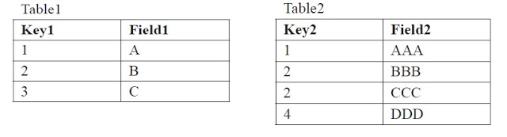
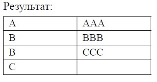
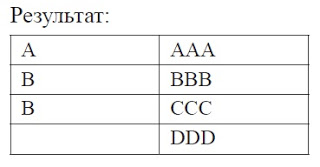

# SQL Interview Questions

## Что такое SQL

**SQL** (_structured query language_ - формальный не процедурный язык программирования, применяемый для создания, модификации и управления данными в произвольной реляционной базе данных, управляемой соответствующей системой управления базами данных (СУБД).

## Какие есть типы JOIN

**INNER JOIN** - внутреннее соединение. В результирующем наборе присутствуют только записи, значения связанных полей в которых совпадают.
**LEFT JOIN** - левое внешнее соединение. В результирующем наборе присутствуют все записи из первой таблицы и соответствующие им записи из второй таблицы. Если соответствия нет, поля из второй таблицы будут пустыми.
**RIGHT JOIN** - правое внешнее соединение. В результирующем наборе присутствуют все записи из второй таблицы и соответствующие им записи из первой таблицы. Если соответствия нет, поля из первой таблицы будут пустыми.
**FULL JOIN** - полное внешнее соединение. Комбинация двух предыдущих. В результирующем наборе присутствуют все записи из первой таблицы и соответствующие им записи из второй таблицы. Если соответствия нет - поля из второй таблицы будут пустыми. Записи из второй таблицы, которым не нашлось пары в первой таблице, тоже будут присутствовать в результирующем наборе. В этом случае поля из первой таблицы будут пустыми.
**CROSS JOIN** - Результирующий набор содержит все варианты комбинации строк из первой таблицы и второй таблицы. Условие соединения при этом не указывается.

## Примеры различий LEFT JOIN и RIGHT JOIN

(_!NeedsWork_)


### LEFT JOIN

```sql
SELECT Table1.Field1, Table2.Field2
FROM Table1
LEFT JOIN Table2
ON Table1.Key1 = Table2.Key2
```

Результат:


### RIGHT JOIN

```sql
SELECT Table1.Field1, Table2.Field2
FROM Table1
RIGHT JOIN Table2
ON Table1.Key1 = Table2.Key2
```

Результат:


## Для чего используется слово HAVING

Ключевое слово HAVING определяет условие, которое затем применяется к групам строк. Следовательно, это предложение имеет тот же смысл для группы строк, что и предложение WHERE в отношении соодержимого соответствующей таблицы. Синтаксис предложения HAVING:
`HAVING  condition` где condition содержит агрегатные функции или константы.

Важно понимать, что секции HAVING и WHERE взаимно дополняют друг друга. Сначала с помощью ограничений WHERE формируется итоговая выборка, затем выполняется разбивка на группы по значениям полей, заданных в GROUP BY. Далее по каждой группе вычисляется групповая функция и в заключение накладывается условие HAVING.
Пример:

```sql
SELECT DeptNum, MAX(SALARY)
FROM Employees
GROUP BY DeptNum
HAVING MAX(SALARY) > 1000
```

В приведенном примере в результат попадут только отделы, максимальная зарплата в которых превышает 1000

## Что такое DLL

**DDL(Data Definition Language)** - Команды определения структуры данных. В состав DDL-группы входят команды, позволяющие определять внутреннюю структуру базы данных. Перед тем, как сохранять данные в БД, необходимо создать в ней таблицы и, возможно, некоторые другие сопутствующие объекты

Пример некоторых DDL-команд:
`CREATE TABLE` - Создание новой таблицы
`DROP TABLE` - Удалить существующую таблицу
