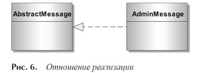
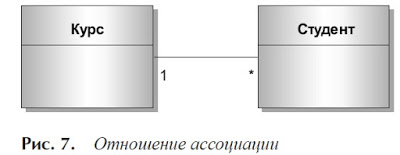
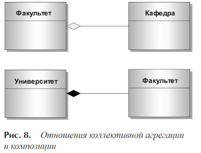

# UML

## Что такое UML

Унифицированный язык моделирования (Unified Modeling Language) - графический язык визуализации, специфицирования, конструирования и документирования программного обеспечения.

## Что такое Нотации и метамодель в UML

Нотация - совокупность графических объектов, которые используются в моделях. В качестве примера на диаграмме показано, как в нотации диаграммы класса определяют понятия и предметы типа «класс», «ассоциацция»,«множественность» и прочее.

Метамодель - диаграмма, определяющая нотацию. Метамодель помогает понять, что такое хорошо организованная, синтаксически правильная, модель.

## Основные понятия

К основным понятиям UML относятся:

- Сущности - абстракции, являющиеся основными элементами модели
- Отношения - связывают различные сущности
- Диаграммы - группируют представляющие интерес совокупности сущностей

## Какие есть типы диаграмм

### Структурные Диаграммы

- Диаграммы классов (class diagrams) предназначены для моделирования структуры объектно-ориентированных приложений - классов, их атрибутов и заголовков методов, наследования, а также связей классов друг с другом;
- Диаграммы компонент (component diagrams) используются при моделировании компонентной структуры распределенных приложений; внутри каждая компонента может быть реализована с помощью множества классов;
- Диаграммы объектов (object diagrams) применяются для моделирования фрагментов работающей системы, отображая реально существующие в runtime экземпляры классов и значения их атрибутов;
- Диаграммы композитных структур (composite structure diagrams) используются для моделирования составных структурных элементов моделей - коопераций, композитных компонент и т.д.;
- Диаграммы развертывания (deployment diagrams) предназначены для моделирования аппаратной части системы, с которой ПО непосредственно связано (размещено или взаимодействует);
- Диаграммы пакетов (package diagrams) служат для разбиения объемных моделей на составные части, а также (традиционно) для группировки классов моделируемого ПО, когда их слишком много.

### Поведенческие Диаграммы

- Диаграммы активностей (activity diagrams) используются для спецификации бизнес-процессов, которые должно автоматизировать разрабатываемое ПО, а также для задания сложных алгоритмов;
- Диаграммы случаев использования(use case diagrams) предназначены для "вытягивания" требований из пользователей, заказчика и экспертов предметной области;
- Диаграммы конечных автоматов (state machine diagrams) применяются для задания поведения реактивных систем;
- Диаграммы взаимодействий (interaction diagrams):
- Диаграммы последовательностей (sequence diagrams) используются для моделирования временных аспектов внутренних и внешних протоколов ПО;
- Диаграммы схем взаимодействия (interaction overview diagrams) служат для организации иерархии диаграмм последовательностей;
- Диаграммы коммуникаций (communication diagrams) являются аналогом диаграмм последовательностей, но по-другому изображаются (в привычной, графовой, манере);
- временные диаграммы (timing diagrams) являются разновидностью диаграмм последовательностей и позволяют в наглядной форме показывать внутреннюю динамику взаимодействия некоторого набора компонент системы.

## Какие отношение обобщения реализуется при наследовании классов

Реализацией (Realization) называется отношение между классификаторами (классами, интерфейсами), при котором один описывает контракт (интерфейс сущности), а другой гарантирует его выполнение.

Ассоциация (Association) показывает, что объект одного класса связан с объектом другого класса и отражает некоторое отношение между ними.

Агрегация - ассоциация, моделирующая взаимосвязь «часть/целое» между классами, которые в то же время могут быть равноправными. Оба класса при этом находятся на одном концептуальном уровне, и ни один не является более важным, чем другой.

